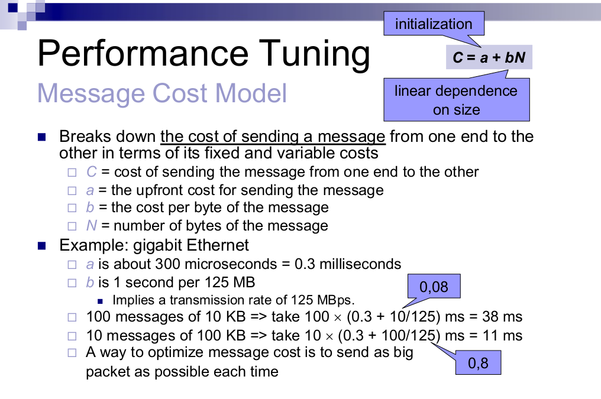

# DS2 (B4M36DS2)

## Questions

- Big Data (V characteristics, current trends), NoSQL databases (motivation, features). Scaling (vertical, horizontal, network fallacies, cluster). Distribution models (sharding, replication, master-slave and peer-to-peer architectures). CAP theorem (properties, ACID, BASE). Consis- tency (strong, eventual, read, write, quora). Performance tuning (Amdahl’s law, Little’s law, message cost model). Polyglot persistence.

- MapReduce (architecture, functions, data flow, execution, use cases). Hadoop (MapReduce, HDFS).

- XPath (path expressions, axes, node tests, predicates). XQuery (constructors, FLWOR, conditional, quantified and comparison expressions). SPARQL (subgraph matching, graph patterns, datasets, filters, solution modifiers, query forms).

- RiakKV (CRUD operations, links, link walking, convergent replicated data types, Search 2.0, vector clocks, Riak Ring, replica placement strategy). Redis (data types, operations, TTL). Cassandra (keyspaces, column families, CRUD operations). MongoDB (CRUD operations,update and query operators, projection, modifiers).
  
- Graph data structures (adjacency matrix, adjacency list, incidence matrix). Data locality (BFS layout, bandwidth minimization problem, Cuthill-McKee algorithm). Graph partitioning (1D partitioning, 2D partitioning). Neo4j (traversal framework, traversal description, traverser). Cypher (graph matching, read, write and general clauses).

## Big Data (V characteristics, current trends), NoSQL databases (motivation, features). Scaling (vertical, horizontal, network fallacies, cluster). Distribution models (sharding, replication, master-slave and peer-to-peer architectures). CAP theorem (properties, ACID, BASE). Consistency (strong, eventual, read, write, quora). Performance tuning (Amdahl’s law, Little’s law, message cost model). Polyglot persistence.

### Big Data:
- 5 V charakteristiky:
  1. Objem (Volume): obrovské množství dat
  2. Rychlost (Velocity): rychlé generování a zpracování dat
  3. Rozmanitost (Variety): různé formáty dat (strukturovaná, nestrukturovaná)
  4. Pravdivost (Veracity): důvěryhodnost a kvalita dat
  5. Hodnota (Value): užitečnost získaných informací z dat
- Současné trendy:
  - Aplikace strojového učení a umělé inteligence
  - Cloud computing pro ukládání a zpracování dat
  - Analýza sociálních sítí a sentimentu
  - Internet věcí (IoT) a chytrá města
  - Zpracování a analýza reálných časových dat

### NoSQL databáze:
- Motivace:
  - Potřeba zpracovávat velké objemy nestrukturovaných dat
  - Rychlost a škálovatelnost
  - Vyšší tolerance k chybám a výpadkům
  - Flexibilita a jednoduchost v návrhu datových modelů
- Vlastnosti:
  - BezSQL (Not-only-SQL): nepoužívají pouze SQL dotazy
  - Škálovatelnost: horizontální škálování, distribuované prostředí
  - Typy NoSQL databází: dokumentové, klíč-hodnota, sloupcové, grafové
  - Eventuální konzistence: ochota obětovat striktní konzistenci za rychlost a škálovatelnost
  - Snadná a rychlá integrace s Big Data aplikacemi

### Škálování:
- Vertikální škálování:
  - Přidávání zdrojů (CPU, paměť, úložiště) do jednoho serveru
  - Omezení: fyzické limity serveru, vyšší cena, možný výpadek v provozu
- Horizontální škálování:
  - Rozdělení zátěže mezi více serverů
  - Výhody: lepší výkonnost, tolerance k výpadkům, snadné přidání dalších serverů
  - Nevýhody: složitější správa, potřeba distribuovaných systémů

### Síťové klamání (Network Fallacies):
1. Spolehlivost sítě
2. Nulová latence
3. Nekonečná šířka pásma
4. Bezpečná síť
5. Homogenita sítě

### Cluster (shluk):
- Skupina propojených serverů pracujících společně jako jeden systém
- Výhody:
  - Zvýšení výkonnosti a zátěžové kapacity
  - Tolerance k výpadkům a zajištění dostupnosti
  - Snadné škálování
- Nevýhody:
  - Složitější správa a konfigurace
  - Vyšší náklady na hardware a software

### Distribuční modely:
- Sharding:
  - Rozdělení dat do menších částí (shard) a uložení na různých serverech
  - Výhody: zvýšení výkonnosti, snížení zátěže, snadné škálování
  - Nevýhody: složitější správa, náročnější na vývoj aplikací
- Replikace:
  - Více kopírování dat mezi servery pro zajištění dostupnosti a zálohy
  - Výhody: zvýšení odolnosti vůči výpadkům, snížení zátěže
  - Nevýhody: zvýšení nákladů na úložiště, režie při synchronizaci dat

### Architektury:
- Master-Slave:
  - Jeden hlavní server (master) a jeden nebo více záložních serverů (slave)
  - Master: spravuje zápis dat, synchronizuje s Slave servery
  - Slave: pouze čtení dat, záložní server pro případ výpadku Master serveru
  - Výhody: zvýšení výkonnosti, snížení zátěže, jednoduchá správa
  - Nevýhody: možný úzký hrdlo (master), složitější zápis dat
- Peer-to-Peer (P2P):
  - Síť, ve které každý uzel komunikuje přímo s ostatními uzly
  - Žádný ústřední server nebo autorita
  - Výhody: škálovatelnost, odolnost vůči výpadkům, decentralizace
  - Nevýhody: složitější správa, zvýšená režie při komunikaci mezi uzly

### CAP věta:
- Vlastnosti:
  1. Konzistence (Consistency): každý uzel v síti vidí stejná data
  2. Dostupnost (Availability): každý dotaz na systém dostane odpověď
  3. Tolerance k rozdělení (Partition Tolerance): systém funguje i při výpadcích části sítě
- CAP věta: v distribuovaném systému nelze zaručit všechny tři vlastnosti současně, pouze dvě z nich

### ACID:
- Vlastnosti transakcí v tradičních (SQL) databázích:
  1. Atomicita (Atomicity): transakce je buď celá provedena nebo vůbec
  2. Konzistence (Consistency): databáze zůstane konzistentní po každé transakci
  3. Izolace (Isolation): paralelní transakce se neovlivňují navzájem
  4. Trvanlivost (Durability): potvrzené transakce jsou trvale uloženy

### BASE:
- Vlastnosti transakcí v NoSQL databázích:
  1. Základní dostupnost (Basically Available): systém je dostupný i při výpadcích části sítě
  2. Měkká stavovost (Soft State): stav systému se může měnit časem, i bez vstupu (snaží se opravovat)
  3. Eventuální konzistence (Eventual Consistency): konzistence dat je zaručena po určitém čase
- BASE je obětování konzistence za dostupnost a toleranci k rozdělení (oproti ACID)

### Konzistence:
- Silná konzistence (Strong Consistency):
  - Každý čtenář vidí nejnovější zápis nebo chybu
  - Zaručuje, že všechny uzly v distribuovaném systému zobrazují stejná data
  - Může mít negativní dopad na výkonnost a škálovatelnost
- Eventuální konzistence (Eventual Consistency):
  - Zaručuje, že všechny změny budou nakonec propagovány do všech uzlů
  - Nezaručuje okamžitou konzistenci dat, ale po určitém čase
  - Výhody: rychlost, škálovatelnost, flexibilita
  - Používáno v NoSQL databázích a BASE systémech

### Konzistence čtení a zápisu:
- Čtenářská konzistence (Read Consistency):
  - Zajišťuje, že čtenář vidí data konzistentní s posledním zápisem
- Zápisová konzistence (Write Consistency):
  - Zajišťuje, že zápis dat je proveden konzistentně napříč všemi uzly

### Kvóra (Quorum):
- Mechanismus pro dosažení konzistence v distribuovaných systémech
- Založeno na hlasování uzlů pro potvrzení čtení a zápisu
- R > W: silná konzistence čtení, slabá konzistence zápisu
- W > R: slabá konzistence čtení, silná konzistence zápisu
- R + W > N: silná konzistence čtení i zápisu, kde N je počet uzlů

### Optimalizace výkonu:

- Amdahlův zákon:
  - Popisuje vliv paralelizace na zrychlení výpočtu
  - Zákon: S = 1 / (P + (1 - P) / N)
    - S: zrychlení výpočtu
    - P: podíl části úkolu, která nemůže být paralelizována
    - N: počet procesorů
  - Ukazuje, že zrychlení je omezeno sériovou částí úkolu

- Littleův zákon:
  - Popisuje vztah mezi počtem přítomných požadavků, rychlostí zpracování a dobou odezvy
  - Zákon: L = λW
    - L: průměrný počet požadavků v systému
    - λ: rychlost příchodu nových požadavků (požadavky za jednotku času)
    - W: průměrná doba odezvy na požadavek
  - Používá se pro optimalizaci front, zpracování požadavků a plánování zdrojů

- Model nákladů na zprávy (Message Cost Model):
  - Model pro analýzu komunikačních nákladů v distribuovaných systémech
  - Faktory ovlivňující náklady:
    - Latence: čas potřebný pro doručení zprávy
    - Šířka pásma: přenosová rychlost mezi uzly
    - Režie: zpracování zpráv na odesílacím a přijímacím uzlu
  - Pomáhá optimalizovat komunikaci mezi uzly a snižovat dobu odezvy

### Polygot persistance

Polyglot persistence je koncept ve správě databází, který zahrnuje použití různých technologií ukládání dat k efektivnějšímu zpracování různých typů datových potřeb v rámci jediné aplikace. Namísto spoléhání se na jednu databázi pro ukládání všech druhů dat, polyglot persistence obhajuje výběr nejlepšího úložného řešení na základě konkrétních požadavků na typ dat, vzorce použití nebo potřebnou funkci. Tento přístup uznává, že žádná jednotlivá databáze nemůže být optimálně efektivní pro všechny druhy dat a dotazů.

- V praxi může platforma elektronického obchodu používat kombinaci databází, jako jsou:
    - Relační databáze pro zpracování transakcí a správu zásob.
    - Úložiště dokumentů pro uživatelské profily a přizpůsobená nastavení.
    - Databáze vyhledávačů pro katalogy produktů a vyhledávací funkce.
    - Databáze grafů pro doporučení založená na uživatelských vztazích a spojeních produktů.
    - Celkově lze říci, že polyglot persistence je o výběru správného nástroje pro správnou práci, maximalizaci efektivity aplikace prostřednictvím strategického využití databáze při zohlednění přidané složitosti a integračních problémů, které tento přístup přináší.