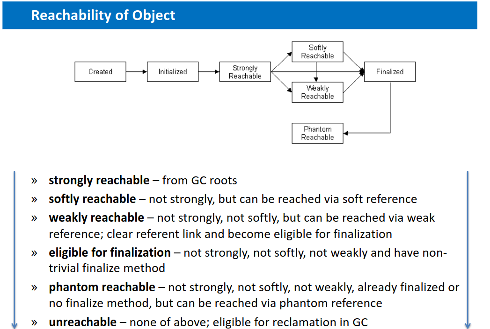

# ESW

## Questions

- Java Virtual Machine, memory layout, frame, stack-oriented machine processing, ordinary object pointer, compressed ordinary object pointer. JVM bytecode, Just-in-time compiler, tired compilation, on-stack replacement, disassembler, decompiler. Global and local safe point, time to safe point. Automatic memory Management, generational hypothesis, garbage collectors. CPU and memory profiling, sampling and tracing approach, warm-up phase.

- Data races, CPU pipelining and superscalar architecture, memory barrier, volatile variable. Synchronization - thin, fat and biased locking, reentrant locks. Atomic operations based on compare-and-set instructions, atomic field updaters. Non-blocking algorithms, wait free algorithms, non-blocking stack (LIFO).

- Static and dynamic memory analysis, shallow and retained size, memory leak. Data Structures, Java primitives and objects, auto-boxing and unboxing, memory efficiency of complex data structures. Collection for performance, type specific collections, open addressing hashing, collision resolution schemes. Bloom filters, complexity, false positives, bloom filter extensions. Reference types - weak, soft, phantom.

- JVM object allocation, thread-local allocation buffers, object escape analysis, data locality, non-uniform memory allocation.

- Networking, OSI model, C10K problem. Blocking and non-blocking input/output, threading server, event-driven server. Event-based input/output approaches. Native buffers in JVM, channels and selectors.

- Synchronization in multi-threaded programs (atomic operations, mutex, semaphore, rw-lock, spinlock, RCU). When to use which mechanism? Performance bottlenecks of the mentioned mechanisms. Synchronization in “read-mostly workloads”, advantages and disadvantages of different synchronization mechanisms.

- Cache-efficient data structures and algorithms (e.g., matrix multiplication). Principles of cache memories, different kinds of cache misses. Self-evicting code, false sharing – what is it and how deal with it?

- Profiling and optimizations of programs in compiled languages (e.g., C/C++). Hardware performance counters, profile-guided optimization. Basics of C/C++ compilers, AST, intermediate representation, high-level and low-level optimization passes.

## Java Virtual Machine, memory layout, frame, stack-oriented machine processing, ordinary object pointer, compressed ordinary object pointer. JVM bytecode, Just-in-time compiler, tired compilation, on-stack replacement, disassembler, decompiler. Global and local safe point, time to safe point. Automatic memory Management, generational hypothesis, garbage collectors. CPU and memory profiling, sampling and tracing approach, warm-up phase.

### Java Virtual Machine (JVM)

- **Definice**: JVM je virtuální stroj, který umožňuje spouštění Java aplikací. Je to abstraktní výpočetní prostředí, které poskytuje běhové prostředí pro Java bytecode.
- **Funkce**:
  - **Interpretace Bytecode**: JVM interpretuje Java bytecode, což je mezikód generovaný kompilátorem Java (javac) z Java zdrojového kódu.
  - **Správa paměti**: JVM automaticky spravuje paměť pomocí garbage collectoru, který recykluje nepoužívané objekty.
  - **Bezpečnost a izolace**: JVM poskytuje bezpečnostní model, který izoluje aplikace běžící na stejné instanci JVM.
  - **Platformová nezávislost**: JVM umožňuje běh Java aplikací na různých platformách bez nutnosti změny zdrojového kódu díky principu "write once, run anywhere".

#### Just-in-Time (JIT) kompilátor
- **Definice**: JIT kompilátor je součást JVM, která dynamicky kompiluje Java bytecode do nativního strojového kódu během běhu aplikace.
- **Funkce**:
  - **Kompilace za běhu**: Místo interpretace bytecode instrukci po instrukci, JIT kompilátor překládá časté části bytecode do nativního strojového kódu, což výrazně zvyšuje výkon.
  - **Optimalizace**: JIT provádí různé optimalizace, jako je inlining, odstranění mrtvého kódu a další techniky, které zlepšují efektivitu běhu kódu.
  - **Adaptivní optimalizace**: JIT může analyzovat běh programu a dynamicky optimalizovat kód podle skutečného chování aplikace.

#### Hlavní rozdíly mezi JVM a JIT
- **Úloha**:
  - **JVM**: Celková platforma, která poskytuje běhové prostředí pro Java aplikace, včetně správy paměti, bezpečnosti a interpretace bytecode.
  - **JIT**: Komponenta JVM zaměřená na optimalizaci výkonu prostřednictvím dynamické kompilace bytecode do nativního kódu.
  
- **Proces zpracování kódu**:
  - **JVM**: Začíná interpretací Java bytecode, což může být pomalejší, ale je jednodušší a méně náročné na paměť.
  - **JIT**: Při detekci často spouštěného kódu jej kompiluje do nativního kódu, čímž zrychluje výkon aplikace.

- **Výkon**:
  - **JVM**: Výkon může být nižší při čisté interpretaci bytecode, protože každá instrukce je prováděna jednotlivě.
  - **JIT**: Výrazně zvyšuje výkon díky tomu, že kompilovaný kód běží rychleji než interpretovaný bytecode.

- **Optimalizace**:
  - **JVM**: Poskytuje základní optimalizace na úrovni správy paměti a bezpečnosti.
  - **JIT**: Provádí pokročilé optimalizace na úrovni kódu za běhu aplikace.

### memory layout

- **Paměťové rozložení**:
  - Skládá se z následujících oblastí:
    1. Metodický (Method) area
    2. Heap (Haldy)
    3. Java stacks
    4. PC (Program Counter) registry
    5. Nativní (Native) metoda stacks
- **Heap (Haldy)**
    - **New Generation**:
      - Mladší generace, kde se ukládají nově vytvořené objekty
      - Dále rozdělen na:
        - Eden Space: místo pro vytváření nových objektů
        - Survivor Spaces (S0 a S1): oblasti pro přeživší objekty z Eden Space
    - **Old Generation**:
        - Starší generace, kam se přesouvají objekty, které přežily několik cyklů Garbage Collection
        - Slouží pro dlouhodobě žijící objekty
- **Frame**:
  - Jednotka paměťového zásobníku (stack) pro každé volání metody
  - Obsahuje:
    - Lokální proměnné
    - Operandový zásobník
    - Odkaz na runtime konstantní pool
  - Při volání metody se vytváří nový rámec
  - Po dokončení metody se rámec uvolní z paměti

### stack-oriented machine processing

- Typ architektury stroje, který využívá zásobník pro provádění operací
- Vlastnosti:
  - Většina operací pracuje s daty na vrcholu zásobníku
  - Instrukce nemají explicitní registry pro uchovávání operandů
  - Operandy jsou načteny na zásobník a výsledky operací jsou uloženy zpět na zásobník
- Proces zpracování:
  1. Načtení operandů na vrchol zásobníku
  2. Provedení operace s vrchními prvky zásobníku
  3. Uložení výsledku operace zpět na vrchol zásobníku
- Výhody:
  - Menší a jednodušší instrukční sada
  - Snadnější implementace v hardwaru nebo softwaru
- Nevýhody:
  - Méně efektivní zpracování dat kvůli častému přesouvání dat na zásobníku
  - Může být pomalejší než registry orientované stroje pro některé úkoly
  
  

### ordinary object pointer

- Ukazatel (nebo reference) používaný pro přístup k objektům v paměti
- Vlastnosti:
  - Umožňuje přímý přístup k objektu v paměti
  - Obvykle obsahuje adresu objektu v paměti
  - V některých jazycích (např. Java) může být ukazatel automaticky aktualizován při přesunu objektu (např. během Garbage Collection)
- Použití:
  - Pro přístup k atributům objektu
  - Pro volání metod objektu
  - Pro předávání objektů jako parametrů funkcí nebo metod
- Bezpečnost:
  - V některých jazycích (např. Java, C#) jsou ukazatele na objekty automaticky spravovány a nemohou být modifikovány programátorem
  - V jiných jazycích (např. C, C++) může být práce s ukazateli riskantní kvůli možnosti chyb v alokaci nebo dealokaci paměti

### compressed ordinary object pointer

- Speciální typ ukazatele na objekt, který šetří paměťový prostor
- Princip:
  - Místo ukládání celé adresy objektu v paměti, ukládá pouze část adresy
  - Tím šetří paměťový prostor při uložení ukazatelů
- Využití:
  - Často používán v prostředích s omezenou pamětí, jako jsou embedded systémy nebo JVM s velkou haldou
- Proces:
  1. Komprese: při vytvoření ukazatele se adresa objektu komprimuje a uloží do komprimovaného ukazatele
  2. Dekomprese: při přístupu k objektu se komprimovaná adresa dekomprimuje, čímž se získá původní adresa objektu v paměti
- Výhody:
  - Šetří paměťový prostor
  - Může zlepšit výkon díky menšímu množství paměťových přístupů
- Nevýhody:
  - Potřeba provádět kompresi a dekompresi při práci s ukazateli
  - Omezený rozsah adres, ke kterým lze přistupovat pomocí komprimovaných ukazatelů (závisí na velikosti komprimovaného ukazatele)

### JVM bytecode

- Středně-úrovňový kód generovaný překladačem Java (javac) z Java zdrojového kódu
- Vlastnosti:
  - Platformově nezávislý
  - Interpretován nebo kompilován do strojového kódu pomocí Java Virtual Machine (JVM)
  - Instrukce o délce 1 bajtu (byte), odtud název bytecode
- Struktura:
  - Sestává z posloupnosti instrukcí, které mohou zahrnovat:
    - Načítání a ukládání proměnných
    - Aritmetické a logické operace
    - Kontrola toku (podmínky, smyčky)
    - Volání metod
    - Práce s objekty a třídami
- Proces:
  1. Překlad: Java zdrojový kód je přeložen do bytecode pomocí javac
  2. Načtení: Bytecode je načten do JVM
  3. Interpretace nebo kompilace: Bytecode je interpretován nebo kompilován do strojového kódu pomocí JVM
  4. Spuštění: Strojový kód je spuštěn na cílovém systému
- Výhody:
  - Platformová nezávislost
  - Snadný přenos mezi různými systémy
  - Možnost optimalizace během kompilace do strojového kódu
- Nevýhody:
  - Pomalejší než nativní strojový kód
  - Vyžaduje instalaci JVM na cílovém systému
  
### Just-in-time compiler

- **Definice**: JIT kompilátor je součást JVM, která dynamicky kompiluje Java bytecode do nativního strojového kódu během běhu aplikace.
- **Funkce**:
  - **Kompilace za běhu**: Místo interpretace bytecode instrukci po instrukci, JIT kompilátor překládá časté části bytecode do nativního strojového kódu, což výrazně zvyšuje výkon.
  - **Optimalizace**: JIT provádí různé optimalizace, jako je inlining, odstranění mrtvého kódu a další techniky, které zlepšují efektivitu běhu kódu.
  - **Adaptivní optimalizace**: JIT může analyzovat běh programu a dynamicky optimalizovat kód podle skutečného chování aplikace.
  
- Kompilátor, který kompiluje kód za běhu programu místo před jeho spuštěním
- Princip:
  - Kompilace zdrojového kódu do nativního strojového kódu za běhu programu
  - Probíhá dynamicky, "na požádání"
- Proces:
  1. Načtení: Zdrojový kód je načten do virtuálního stroje nebo runtime prostředí
  2. Interpretace: Zdrojový kód je nejprve interpretován
  3. Profiling: Během interpretace je prováděn profiling kódu pro zjištění často volaných částí (hotspots)
  4. Kompilace: JIT kompilátor kompiluje často volané části zdrojového kódu do nativního strojového kódu
  5. Spuštění: Nativní strojový kód je spuštěn na cílovém systému
- Příklad: Java Virtual Machine (JVM) používá JIT kompilátor pro kompilaci Java bytecode do nativního strojového kódu za běhu
- Výhody:
  - Rychlejší běh programu než při pouhé interpretaci
  - Možnost optimalizace kódu za běhu na základě aktuálního chování programu
  - Přizpůsobení kódu specifickým vlastnostem hardware a operačního systému za běhu
- Nevýhody:
  - Vyšší režie při kompilaci za běhu, což může zpomalit spuštění programu
  - Vyžaduje více paměti pro uchování kompilovaného kódu
  - 
### tired compilation

- Technika používaná u Just-In-Time (JIT) kompilátorů, která kombinuje různé úrovně optimalizace
- Princip:
  - Kód je postupně kompilován a optimalizován na základě jeho výkonu a četnosti volání
  - Používá více úrovní kompilace s různými úrovněmi optimalizace
- Proces:
  1. Načtení: Zdrojový kód je načten do virtuálního stroje nebo runtime prostředí
  2. Interpretace: Zdrojový kód je nejprve interpretován
  3. Nízkoúrovňová kompilace: Často volané části kódu jsou kompilovány s nízkou úrovní optimalizace (rychlejší kompilace, méně optimalizací)
  4. Profiling: Během běhu programu se sbírají informace o výkonu kompilovaného kódu
  5. Vysokoúrovňová kompilace: Pokud je to výhodné, části kódu mohou být kompilovány s vyšší úrovní optimalizace (pomalejší kompilace, více optimalizací)
- Příklad: Java Virtual Machine (JVM) podporuje tiered compilation v rámci svého JIT kompilátoru
- Výhody:
  - Rychlejší spuštění programu díky rychlé nízkoúrovňové kompilaci
  - Možnost využít vysokoúrovňové optimalizace pro části kódu, které mají zásadní vliv na výkon programu
  - Lepší vyvážení mezi rychlostí kompilace a výkonem programu
- Nevýhody:
  - Vyšší režie při provádění více úrovní kompilace a profilingu za běhu programu
  - Vyžaduje více paměti pro uchování kompilovaného kódu a profilingových dat
  
  

### on-stack replacement

- Technika používaná v Just-In-Time (JIT) kompilátorech pro optimalizaci běžících funkcí za běhu programu
- Princip:
  - Nahrazuje aktuálně běžící funkci (interpretovanou nebo kompilovanou s nižší úrovní optimalizace) její optimalizovanou verzí
  - Umožňuje získat výhody optimalizací i pro dlouho běžící funkce
- Proces:
  1. Profiling: Během běhu programu se sbírají informace o výkonu funkcí
  2. Optimalizace: JIT kompilátor kompiluje optimalizovanou verzi funkce
  3. Nahrazení: Aktuálně běžící funkce je nahrazena optimalizovanou verzí
  4. Spuštění: Optimalizovaná funkce pokračuje v běhu od místa, kde byla původní funkce přerušena
- Příklad: Java Virtual Machine (JVM) podporuje on-stack replacement v rámci svého JIT kompilátoru
- Výhody:
  - Zlepšení výkonu dlouho běžících funkcí díky optimalizacím
  - Umožňuje aplikovat optimalizace za běhu programu bez nutnosti restartu
- Nevýhody:
  - Vyšší režie při provádění nahrazení běžící funkce
  - Složitost implementace OSR ve virtuálním stroji nebo JIT kompilátoru
  
### disassembler

- Nástroj, který převádí strojový kód nebo spustitelný soubor zpět na čitelnější formát, jako je assembler
- Princip:
  - Analyzuje strojový kód a hledá odpovídající assemblerové instrukce
  - Vytváří textový výstup s assemblerovým kódem a dalšími informacemi, jako jsou adresy, hodnoty registrů, atd.
- Proces:
  1. Načtení: Disassembler načte strojový kód nebo spustitelný soubor
  2. Dekódování: Strojové instrukce jsou dekódovány na odpovídající assemblerové instrukce
  3. Výstup: Výsledný assemblerový kód je zobrazen nebo uložen do souboru
- Použití:
  - Analýza a ladění spustitelných souborů
  - Zjištění funkcionality neznámého nebo podezřelého kódu (např. malware)
  - Reverzní inženýrství, zkoumání algoritmů a optimalizací v cizím kódu
- Výhody:
  - Umožňuje získat vhled do chování strojového kódu nebo spustitelného souboru
  - Pomáhá při analýze a ladění programů
- Nevýhody:
  - Assemblerový kód je obtížnější číst a porozumět než zdrojový kód vysokoúrovňových jazyků
  - Ztráta informace o proměnných, funkcích a komentářích, které byly v původním zdrojovém kódu
  - Může být omezen na konkrétní architekturu nebo operační systém
  
### decompiler

- Nástroj, který převádí strojový kód nebo spustitelný soubor zpět na zdrojový kód vysokoúrovňového programovacího jazyka
- Princip:
  - Analyzuje strojový kód a rekonstruuje odpovídající zdrojový kód vysokoúrovňového jazyka
  - Vytváří textový výstup se zdrojovým kódem a dalšími informacemi, jako jsou názvy proměnných, funkce, atd.
- Proces:
  1. Načtení: Dekompilátor načte strojový kód nebo spustitelný soubor
  2. Dekódování: Strojové instrukce jsou dekódovány a zkonstruován odpovídající zdrojový kód vysokoúrovňového jazyka
  3. Výstup: Výsledný zdrojový kód je zobrazen nebo uložen do souboru
- Použití:
  - Analýza a ladění spustitelných souborů
  - Zjištění funkcionality neznámého nebo podezřelého kódu (např. malware)
  - Reverzní inženýrství, zkoumání algoritmů a optimalizací v cizím kódu
- Výhody:
  - Umožňuje získat vhled do chování strojového kódu nebo spustitelného souboru v čitelnější formě
  - Pomáhá při analýze a ladění programů
- Nevýhody:
  - Získaný zdrojový kód může být méně čitelný a komplexnější než původní zdrojový kód
  - Ztráta informace o původních názvech proměnných, funkcí a komentářích
  - Může být omezen na konkrétní programovací jazyk, architekturu nebo operační systém

### Global and local safe point, time to safe point

- Koncept používaný v runtime systémech, např. Java Virtual Machine (JVM)
- Bezpečný bod je místo v kódu, kde se runtime prostředí může přesvědčit, že žádné nebezpečné operace nebudou probíhat (např. úpravy objektů v paměti)
- Umožňuje provádět akce, které vyžadují kooperaci mezi vlákny nebo synchronizaci s garbage collectorem

- TTSP (time to safepoint) je doba, která uplyne mezi pořadavkem o safepoint a nastáním safepointu.

- Obecně řečeno se pod označením safe-point skrývají určitá místa v bajtkódu či v přeloženém strojovém kódu, v nichž může dojít k pozastavení běhu vláken, aby mohl virtuální stroj Javy provést nějakou operaci, která vyžaduje, aby všechna aplikační vlákna byla nejenom pozastavena, ale aby byla navíc pozastavena v přesně definovaném stavu. Nejtypičtějším důvodem pro použití safe-pointů je nutnost spouštět správce paměti (GC – Garbage Collector), protože se při úklidu paměti mohou měnit adresy jednotlivých objektů a všechna běžící vlákna musí po proběhnutí GC již pracovat s novými adresami (na úrovni programovacího jazyka Java samozřejmě nemáme k přímým adresám přístup).

Význam času do bezpečného bodu:

- Krátký čas do bezpečného bodu zvyšuje pružnost runtime prostředí a umožňuje rychlejší koordinaci mezi vlákny a garbage collectorem
- Dlouhý čas do bezpečného bodu může způsobit zpoždění a snížení výkonu aplikace, protože vlákna nemohou být rychle zastavena pro kooperaci s garbage collectorem nebo pro jiné akce vyžadující koordinaci mezi vlákny
- Optimalizace kódu a runtime prostředí mohou pomoci snížit čas do bezpečného bodu, např. zvyšováním frekvence volání bezpečných bodů nebo zlepšením implementace bezpečných bodů
  
#### Globální bezpečný bod (Global Safe Point):
- Všechna vlákna v runtime prostředí jsou pozastavena na bezpečných bodech
- Často využíván při stop-the-world fázi garbage collectoru
- Výhody:
  - Zjednodušuje garbage collection, protože nedochází k současným úpravám objektů
  - Umožňuje provádět operace s globálním dopadem na runtime prostředí
- Nevýhody:
  - Způsobuje přerušení všech vláken, což může způsobit zpoždění a snížení výkonu aplikace

#### Lokální bezpečný bod (Local Safe Point):

- Vlákno dosáhne bezpečného bodu nezávisle na ostatních vláknech
- Používá se pro akce, které vyžadují kooperaci mezi vlákny, ale nepotřebují zastavit všechna vlákna
- Výhody:
  - Méně náročné na výkon než globální bezpečný bod, protože nepozastavuje všechna vlákna
  - Umožňuje provádět operace s lokálním dopadem na runtime prostředí
- Nevýhody:
  - Může být složitější koordinovat akce mezi vlákny
  - Méně vhodné pro operace s globálním dopadem na runtime prostředí
  - 
### Automatic memory Management, generational hypothesis, garbage collectors

- Koncept, který se používá v programovacích jazycích a runtime prostředích, kde je paměťová správa automaticky řízena systémem, např. Java Virtual Machine (JVM)
- Hlavní součástí automatické správy paměti je garbage collector
  
Funkce automatické správy paměti:
- Alokace paměti: Přidělení paměti pro nové objekty a proměnné
- Uvolňování paměti: Systém automaticky detekuje a uvolňuje paměť, která již není potřeba (nepoužívané objekty)
- Minimalizace úniku paměti a fragmentace: Garbage collector se snaží minimalizovat úniky paměti a její fragmentaci

Výhody automatické správy paměti:
- Zjednodušuje programování, protože se programátor nemusí starat o přidělování a uvolňování paměti
- Snížení chyb spojených s paměťovou správou, jako jsou úniky paměti nebo přístup k nealokované paměti
- Zvyšuje bezpečnost a stabilitu aplikace, protože garbage collector detekuje a řeší problémy s paměťovou správou

Nevýhody automatické správy paměti:
- Vyšší režie a zátěž systému kvůli garbage collectoru a automatickému přidělování/uvolňování paměti
- Menší kontrola nad správou paměti, což může vést k suboptimálnímu výkonu aplikace v některých případech
- Předvídatelnost a výkon garbage collectoru závisí na implementaci a konfiguraci runtime prostředí

Generační hypotéza (Generational Hypothesis):
- Teorie, která se používá při návrhu a implementaci garbage collectorů v automatických správách paměti, jako je Java Virtual Machine (JVM)
- Hypotéza předpokládá, že většina objektů v paměti má krátkou životnost, zatímco jen malé procento objektů má dlouhou životnost

Principy generační hypotézy:

1. Mnoho objektů zemře mladých: Většina objektů má krátkou životnost a je rychle zničena
2. Málo starých objektů odkazuje na mladé: Méně často dochází k odkazům mezi starými a mladými objekty
3. Málo objektů přežije dlouhou dobu: Jen malé procento objektů má dlouhou životnost

Aplikace generační hypotézy na garbage collectory:

- Garbage collectory využívají generační hypotézu pro optimalizaci paměťové správy
- Paměť je rozdělena na dvě nebo více generací, např. "new generation" (mladá generace) a "old generation" (stará generace)
- Mladá generace obsahuje nově vytvořené objekty, které mají tendenci rychle zaniknout
- Stará generace obsahuje objekty, které přežily několik cyklů garbage collection a mají tendenci mít delší životnost
- Garbage collector se zaměřuje na mladou generaci, kde často probíhá uvolňování paměti, a méně často na starou generaci

Výhody použití generační hypotézy:

- Zlepšuje výkon garbage collectoru, protože se zaměřuje na části paměti, kde je největší pravděpodobnost uvolnění paměti
- Snížení režie a zátěže systému spojené s garbage collection
- Minimalizace zpoždění a přerušení způsobených garbage collection

Nevýhody použití generační hypotézy:

- Vyšší složitost implementace garbage collectoru
- Možná suboptimální výkon v případech, kdy hypotéza neodpovídá skutečnému chování aplikace

### Garbage Collectory:

- Součást automatické správy paměti v runtime prostředích, jako je Java Virtual Machine (JVM)
- Starají se o automatické uvolňování paměti, která již není používána (nepotřebné objekty)
- Zajišťují, že aplikace nevyčerpá dostupnou paměť a snižují riziko úniků paměti

**Serial Collector**

kontext: Nejstarší a nejjednodušší forma garbage collection v Javě, využívající jeden vlákno.

Výhody: Jednoduchost a minimální využití zdrojů, což ho činí ideálním pro malé aplikace.

Nevýhody: Způsobuje pauzy aplikace, nevhodný pro větší nebo interaktivní aplikace.

Použití: Malé aplikace nebo prostředí, kde je omezený výpočetní výkon a paměť.

**Paralelní sběrač (Throughput Collector)**

kontext: Zvyšuje výkon použitím více vláken pro garbage collection, optimalizovaný pro propustnost.

Výhody: Lepší využití vícejádrových procesorů, vhodný pro aplikace, kde je prioritou propustnost.

Nevýhody: Mohou se objevit delší pauzy při GC, což ovlivňuje výkon v reálném čase.

Použití: Serverové a dávkové zpracování, kde je vysoká propustnost nezbytná a delší pauzy jsou přijatelné.

**Garbage First (G1) Collector**

kontext: Moderní sběrač navržený k dosažení předvídatelného času pauzy správou haldy v malých oblastech a prioritizací garbage collection v oblastech s nejvíce obnovitelným prostorem.

Oblasti haldy: Dělí haldu na mnoho malých oblastí, které jsou ošetřovány individuálně, což umožňuje sběrači zaměřit se na oblasti s nejvíce odpady pro optimalizaci času pauzy.

Výhody: Předvídatelné pauzy GC, efektivní správa velkých hald a zlepšený výkon ve vícejádrových prostředích.

Nevýhody: Složitá konfigurace a potenciální režijní náklady z řízení více oblastí a metadat.

Použití: Velké, vícejádrové aplikace, kde jsou prioritou nízké časy pauz a efektivní správa haldy.

Využívá několik technik pro optimalizaci správy paměti, například dělení haldy na malé regiony a prioritizaci regionů s nejvíce nevyužitelným místem k uvolnění. Hlavní činnosti G1 zahrnují:

- Menší sběry (Minor Collections): Zpracovávají regiony Eden a Survivor a kopírují přežívající objekty do nových Survivor regionů.
- Smíšené sběry (Mixed Collections): Zahrnují regiony Eden, Survivor a vybrané staré regiony.
- Plné sběry (Full Collections): Logicky dělí starou generaci na regiony a provádí paralelní značkování a kompakci.
  
G1 poskytuje predikovatelné pauzy a efektivní správu velkých hald, což ho činí vhodným pro víceprocesorové prostředí s požadavkem na nízké pauzy. Některé nevýhody zahrnují složitost konfigurace a potenciální režijní náklady spojené s řízením více regionů a metadat​

Některé typy garbage collectorů:

1. Mark and Sweep (Označit a Zamést):
   - Pracuje ve dvou fázích:
     1. Označení: Prochází živé objekty a označuje je jako dosažitelné
     2. Zametání: Uvolňuje paměť obsazenou objekty, které nebyly označeny jako dosažitelné
   - Nevýhody: Může způsobovat fragmentaci paměti a zpoždění při provádění garbage collection

2. Generational (Generační):
   - Paměť je rozdělena na mladou a starou generaci
   - Využívá generační hypotézu pro efektivnější garbage collection
   - Častěji provádí garbage collection v mladé generaci, kde je vyšší pravděpodobnost uvolnění paměti
   - Výhody: Snížení režie a zátěže systému, minimalizace zpoždění způsobených garbage collection
   - Nevýhody: Vyšší složitost implementace

### TLAB

V Javě se TLAB (Thread-Local Allocation Buffer) používá pro efektivní přidělování paměti v vícevláknových aplikacích. TLAB je speciální oblast v hromadě paměti (heap), která je přidělena každému vláknu zvlášť. Toto umožňuje vláknum provádět alokace paměti bez nutnosti synchronizace s ostatními vlákny, což značně zlepšuje výkon.

### CPU and memory profiling

- Techniky používané pro analýzu výkonu a chování aplikace s ohledem na zpracování CPU a využití paměti
- Cílem je identifikovat horké body (bottlenecks), optimalizovat výkon a zlepšit paměťovou efektivitu aplikace

CPU profiling:

- Zaměřuje se na měření a analýzu výkonu aplikace v souvislosti s využitím procesoru
- Identifikuje funkce a části kódu, které vyžadují nejvíce času na zpracování
- Pomáhá zjistit, kde lze provést optimalizace kódu pro zlepšení celkového výkonu aplikace

Metody CPU profilingu:

1. Sampling (vzorkování): Pravidelně sbírá informace o zásobníku volání (call stack) během běhu aplikace
2. Instrumentace: Vkládá sledovací kód přímo do aplikace, který zaznamenává informace o výkonu a zátěži CPU

Paměťový profiling:
- Zaměřuje se na analýzu využití paměti aplikací
- Identifikuje objekty, které způsobují zvýšené využití paměti, úniky paměti nebo fragmentaci paměti
- Pomáhá zjistit, jak lze zlepšit paměťovou efektivitu a snížit nároky na paměť aplikace

Metody paměťového profilingu:
1. Heap snapshot (snímek haldy): Zaznamenává stav paměti (haldy) v určitém čase, identifikuje objekty a jejich velikosti
2. Allocation tracking (sledování alokace): Sleduje vytváření a uvolňování objektů v paměti během běhu aplikace
3. Garbage collection profiling: Analyzuje chování garbage collectoru, identifikuje dlouhotrvající operace a možné optimalizace

Nástroje pro CPU a paměťový profiling:
- Existuje mnoho nástrojů a knihoven pro různé jazyky a prostředí, například:
  - VisualVM (pro Java)
  - Valgrind (pro C/C++)
  - Py-Spy (pro Python)
  - Ruby-prof (pro Ruby)

### sampling and tracing approach

Dvě hlavní metody používané při profilování výkonu aplikací, zejména v souvislosti s CPU a paměťovým profilingem

Sampling periodically checks the application's state at intervals, capturing the current function call stack.

Tracing, also known as instrumentation, involves monitoring every function call, return, and sometimes other significant events within the application. This method modifies the code to add logging or monitoring instructions, which report these events to the profiler.

Vzorkování (Sampling):

- Pravidelně sbírá informace o zásobníku volání (call stack) během běhu aplikace
- Zkoumá výkon aplikace v pravidelných intervalech a zaznamenává aktuální stav
- Menší režie než u trasování, protože se nezasahuje do každé funkce nebo události
- Méně přesné než trasování, protože data jsou založena na vzorcích a mohou být ovlivněna časováním nebo frekvencí vzorkování

Trasování (Tracing):

- Vkládá sledovací kód přímo do aplikace, který zaznamenává informace o výkonu a zátěži
- Sleduje všechny funkce, události a interakce v aplikaci, což poskytuje detailní informace o výkonu
- Vyšší režie než u vzorkování, protože se zaznamenává každá funkce a událost
- Přesnější než vzorkování, protože data jsou založena na skutečném chování aplikace, nikoli na vzorcích

Kdy použít vzorkování nebo trasování:

- Vzorkování je vhodné pro rychlou a hrubou analýzu výkonu aplikace, kde je důležitější minimalizace režie než přesnost dat
- Trasování je vhodné pro detailní a přesnou analýzu výkonu aplikace, kde je důležitější získat kompletní informace o chování aplikace než minimalizovat režii
- Ve většině případů je vhodné použít kombinaci obou přístupů pro dosažení nejlepších výsledků při analýze výkonu aplikace

### warm-up phase

- Období, kdy se aplikace nebo systém rozehřívá a dosahuje optimálního výkonu
- Během fáze rozehřátí může aplikace nebo systém provádět různé inicializační úkoly, kompilaci, optimalizace nebo jiné nastavení
- Výkon aplikace nebo systému během fáze rozehřátí může být pomalejší než po dosažení optimálního výkonu

Důvody pro fázi rozehřátí:

1. Just-In-Time (JIT) kompilace: Aplikace založené na bytecode, jako je Java, používají JIT kompilátor pro kompilaci bytecode na strojový kód během runtime. Tato kompilace může trvat určitý čas a zpočátku zpomalit výkon.
2. Profilování a optimalizace: Aplikace nebo systém mohou provádět profilování a optimalizace během fáze rozehřátí, což může způsobit zpoždění v dosažení plného výkonu.
3. Cache a přednačítání: Aplikace mohou mít cache nebo přednačítání dat, které mohou být potřeba pro rychlejší běh. Tyto cache nebo přednačítaná data se mohou postupně naplňovat během fáze rozehřátí.

Jak zohlednit fázi rozehřátí při testování výkonu:
- Během testování výkonu je důležité zohlednit fázi rozehřátí, protože může ovlivnit výsledky testů
- Testy by měly být prováděny po dosažení optimálního výkonu aplikace nebo systému, aby poskytovaly správné a relevantní výsledky
- Mohou být použity různé techniky pro zohlednění fáze rozehřátí, například:
  - Provedení několika krátkých běhů aplikace nebo testů před spuštěním hlavního testu
  - Použití statistických metod pro eliminaci nebo minimalizaci vlivu fáze rozehřátí na výsledky testů

## Data races, CPU pipelining and superscalar architecture, memory barrier, volatile variable. Synchronization - thin, fat and biased locking, reentrant locks. Atomic operations based on compare-and-set instructions, atomic field updaters. Non-blocking algorithms, wait free algorithms, non-blocking stack (LIFO).

### Data races

- Problém v paralelním programování, kdy dojde ke konkurenčnímu přístupu dvou nebo více vláken k témuž datovému objektu bez vhodné synchronizace
- Může vést k nekonzistentním a nepředvídatelným výsledkům, což ztěžuje ladění a opravu chyb
- Nejčastěji se vyskytuje v programovacích jazycích, které umožňují ruční správu vláken a synchronizaci, jako jsou C++, Java nebo C#

Příčiny data race:
1. Neexistující nebo nesprávná synchronizace přístupu k datům
2. Chybějící zámky (locks) nebo bariéry (barriers) pro omezení přístupu k datům
3. Nesprávná implementace atomických operací nebo kritických sekcí

Jak předcházet data race:
1. Použití zámků (locks) pro zajištění vzájemného vyloučení při přístupu k datům
2. Využití atomických operací, které zajišťují, že během provedení operace nedojde k přerušení vlákny
3. Použití bariér (barriers) nebo podmínek (conditions) pro koordinaci a synchronizaci vláken
4. Vhodná dekompozice úloh a dat pro snížení potřeby sdílení dat mezi vlákny
5. Použití vysokoúrovňových abstrakcí a knihoven pro paralelní programování, které řeší synchronizaci za vás (např. OpenMP, TBB, C++11 threads)

Detekce data race:
- Existují nástroje a techniky pro automatickou detekci data race, například:
  - Statická analýza kódu: Nástroje jako Clang Static Analyzer nebo PVS-Studio mohou pomoci identifikovat možné data race v kódu
  - Dynamická analýza běhu: Nástroje jako Helgrind (součást Valgrind), ThreadSanitizer nebo Intel Inspector mohou sledovat běh aplikace a detekovat data race za běhu
  
### CPU pipelining and superscalar architecture

CPU pipelining (potrubí):

- Technika zvyšování výkonu procesoru tím, že se zpracování instrukcí rozdělí do několika menších kroků (fází)
- Každá fáze zpracovává část instrukce a poté ji předává další fázi
- Umožňuje paralelní zpracování více instrukcí, kdy každá instrukce prochází jednotlivými fázemi potrubí

Superskalární architektura:

- Rozšíření pipeliningu, které umožňuje zpracovávat více instrukcí současně v rámci jednoho cyklu hodinových tiků
- Superskalární procesory mají více výkonných jednotek, které mohou zpracovávat instrukce paralelně
- Díky této architektuře je možné dosáhnout vyššího výkonu a rychlejšího zpracování instrukcí než u tradičních pipelined procesorů
- rozdíl s více procesory je ten, že se ALU znásobí jen v některých částech
  

Kombinace CPU pipeliningu a superskalární architektury:

1. Instrukce jsou načítány do potrubí a rozděleny do menších kroků (fází)
2. Procesor s superskalární architekturou může zpracovávat více instrukcí současně v rámci jednoho cyklu hodinových tiků
3. Výsledkem je vyšší výkon a rychlejší zpracování instrukcí

Příklady procesorů s pipeliningem a superskalární architekturou:

- Většina moderních procesorů (Intel Core, AMD Ryzen) používá kombinaci pipeliningu a superskalární architektury pro dosažení vysokého výkonu
  
### memory barrier 

- Mechanismus v paralelním programování, který zajišťuje správné pořadí přístupu k paměti mezi různými vlákny nebo procesory
- Pomáhá předcházet problémům se souběžností, jako jsou data race nebo nekonzistence paměti
- Paměťové bariéry mohou být implementovány na úrovni hardware (CPU instrukce) nebo software (programovací jazyk, knihovny)

Účel paměťových bariér:

1. Zajištění, že zápis nebo čtení určitých dat je dokončeno před pokračováním dalších operací
2. Zajištění, že změny v paměti provedené jedním vláknem nebo procesorem jsou viditelné pro ostatní vlákna nebo procesory
3. Zajištění, že operace na sdílených datech jsou prováděny ve správném pořadí

Příklady paměťových bariér:

- V jazyce C++ mohou být použity atomické operace s různými paměťovými řády (memory_order) pro zajištění správného pořadí přístupu k paměti
- V jazyce Java mohou být použity synchronizované bloky nebo volatile proměnné pro zajištění správného pořadí přístupu k paměti
- Některé CPU instrukce, jako je mfence, sfence a lfence na platformě x86, poskytují paměťové bariéry na úrovni hardware

### volatile variable

- Klíčové slovo `volatile` v programovacích jazycích (jako C, C++ nebo Java) označuje proměnnou, která může být změněna vnějšími procesy nebo paralelními vlákny
- Při použití `volatile` kompilátor a běhové prostředí zajišťují, že přístupy k této proměnné nebudou optimalizovány ani mezipaměťovány, což zajišťuje konzistentní a aktuální hodnoty pro všechna vlákna
  
#### Java
- `volatile` v Javě se používá pro označení proměnné, jejíž hodnota může být modifikována více vlákny a jejíž přístupy by neměly být optimalizovány.
- Klíčové vlastnosti:
  - Viditelnost: Čtení a zápis proměnné označené jako `volatile` jsou zaručeně viditelné pro ostatní vlákna.
  - Pořadí: Ustanovuje vzájemný vztah happens-before, což zajišťuje, že akce před zápisem do `volatile` proměnné se provedou před následujícími akcemi po jejím čtení.
  - Atomické R/W operace
- Použití:
  - Jednoduché příznakové proměnné sdílené mezi více vlákny.
  - Koordinace mezi vlákny pomocí sdílené proměnné.
- Omezení:
  - Neposkytuje atomicitu pro složené operace.
  - Omezené synchronizační schopnosti ve srovnání s `synchronized` bloky, zámky nebo atomickými třídami.

#### C++
- Klíčové slovo `volatile` v C++ označuje, že hodnota proměnné se může kdykoliv změnit bez vědomí kompilátoru, často z důvodu externích faktorů.
- Klíčové vlastnosti:
  - Čtení/Zápis volatile: Přikazuje kompilátoru vždy číst a zapisovat do paměti pro danou proměnnou, aniž by se spoléhal na mezipaměťové hodnoty.
  - Externí modifikace: Označuje, že proměnnou mohou měnit externí faktory, jako je hardware nebo jiná vlákna.
- Použití:
  - Přístup k registrům hardware připojených k paměti.
  - Vícevláknové prostředí, kde více vláken přistupuje ke stejné proměnné.
- Omezení:
  - Samotné `volatile` neposkytuje záruky synchronizace nebo atomicity.
  - Pro synchronizaci a viditelnost napříč více jádry nebo vlákny je nutné použít vhodné synchronizační mechanismy, jako jsou mutexy, atomické typy nebo bariéry paměti.

### Synchronization - thin, fat and biased locking, reentrant locks 

Tenký zámek (Thin lock):

- Lehký zámek s nízkým režijním zatížením, používaný v situacích, kdy není vysoká konkurence mezi vlákny
- Rychlý a efektivní způsob zajištění synchronizace pro jednoduché případy
- V případě zvýšené konkurence mezi vlákny může být tenký zámek transformován na tlustý zámek

Tlustý zámek (Fat lock):

- Robustnější zámek s vyšším režijním zatížením, používaný v situacích, kdy je vysoká kontestace mezi vlákny
- Poskytuje lepší výkon při zajištění synchronizace v případě, že se více vláken soupeří o přístup ke sdíleným zdrojům
- Transformace z tenkého zámku na tlustý zámok probíhá za běhu, pokud je to nutné

Zaujatý zámek (Biased locking):

- Optimalizace zámku, která zvyšuje výkon synchronizace v situacích, kdy objekt používá jedno vlákno a ostatní vlákna se o něj nezajímají
- Zámek je "zaujatý" ve prospěch jednoho vlákna, které může provádět synchronizované operace bez nutnosti získávání zámku
- Pokud se objekt stane kontestovaným mezi více vlákny, zaujatý zámek může být zrušen a převeden na tenký nebo tlustý zámek

Reentrant zámky:

- Typ synchronizačního mechanismu, který umožňuje vláknu získat zámek vícekrát, aniž by došlo k uváznutí (deadlock)
- Reentrant zámek sleduje, které vlákno drží zámek a kolikrát ho získalo
- Vlákno může opustit zámek pouze tehdy, pokud uvolní zámek stejný počet, kolikrát ho získalo

Vlastnosti reentrant zámků:

1. Povolují vnořené zamykání (nested locking), což umožňuje vláknu získat zámek vícekrát, aniž by došlo k uváznutí
2. Zvyšují robustnost kódu tím, že se zabrání uváznutí při opakovaném získání zámku stejným vláknem
3. Mohou poskytnout pokročilé funkce, jako je podpora přerušitelného zamykání, časově omezené zamykání nebo spravedlivé plánování

### Atomic operations based on compare-and-set instructions, atomic field updaters

- Atomické operace, které kombinují porovnání a nastavení hodnoty v jediném nesdíleném (atomic) kroku
- Běžně používány pro implementaci bezpečných a efektivních synchronizačních mechanismů, jako jsou zámky, semafory nebo počítadla
- Základem pro mnoho lock-free a wait-free algoritmů, které umožňují vysoký výkon a škálovatelnost v paralelním prostředí
  
Princip compare-and-set (CAS) operace:

1. Porovnej hodnotu sdílené proměnné s očekávanou hodnotou
2. Pokud se hodnoty shodují, nastav novou hodnotu proměnné
3. Operace vrátí informaci, zda byla hodnota úspěšně nastavena nebo ne

Výhody compare-and-set operací:

- Poskytují atomičnost a zajišťují konzistenci dat při přístupu více vláken
- Mohou snižovat režijní zatížení v porovnání s tradičními zámky nebo synchronizačními mechanismy
- Umožňují vytvářet lock-free a wait-free algoritmy, které jsou škálovatelné a odolné vůči uváznutí (deadlock) a vyhladovění (starvation)

Atomické aktualizátory polí (Atomic Field Updaters):

- Specializované utility pro atomické aktualizace polí objektů bez nutnosti vytvářet nové objekty s atomickými proměnnými
- Umožňují provádět operace na jednotlivých polích objektů, které jsou atomické a bezpečné při současném přístupu více vláken
- Zvyšují výkon a snižují režijní zatížení v paralelním prostředí díky snížení počtu vytvořených objektů

Výhody atomických aktualizátorů polí:

- Poskytují atomičnost a zajišťují konzistenci dat při přístupu více vláken k jednotlivým polím objektů
- Snížení režijního zatížení a zlepšení výkonu v paralelním prostředí díky menšímu počtu vytvořených objektů
- Umožňují vytvářet lock-free a wait-free algoritmy pro práci s objekty

Použití atomických aktualizátorů polí:

- V jazyce Java lze použít třídy `AtomicIntegerFieldUpdater`, `AtomicLongFieldUpdater` a `AtomicReferenceFieldUpdater` z balíčku `java.util.concurrent.atomic`
- Pro jejich použití je nutné definovat pole objektu jako `volatile`

### Non-blocking algorithms, wait free algorithms, non-blocking stack (LIFO).

#### Neblokující algoritmy (Non-blocking algorithms):

**V informatice se algoritmus nazývá neblokující, pokud selhání nebo pozastavení jakéhokoli vlákna nemůže způsobit selhání nebo pozastavení jiného vlákna**

- Typ algoritmů, které nezabraňují přístupu k sdíleným datům nebo zdrojům jiným vláknům, když je prováděna operace
- Zajišťují, že žádné vlákno nebude čekat na neomezeně dlouhou dobu na dokončení operace prováděné jiným vláknem
- Mohou být klasifikovány jako lock-free, wait-free nebo obstruction-free, v závislosti na garancích, které poskytují

Typy neblokujících algoritmů:

1. Lock-free algoritmy:
   - Zajišťují, že alespoň jedno vlákno dokončí svou operaci v konečném čase
   - alespoň jedno vlákno musí dělat progres
   - Zabraňují uváznutí (deadlocks) a vyhladovění (starvation)
2. Wait-free algoritmy:
   - Poskytují garanci, že každé vlákno dokončí svou operaci v konečném čase
   - Zabraňují uváznutí, vyhladovění a čekání na dokončení jiných vláken
3. Obstruction-free algoritmy:
   - Poskytují garanci, že operace bude dokončena v konečném čase pouze v případě, že žádné jiné vlákno nezasahuje do provádění operace
   - Slabší záruky než lock-free a wait-free algoritmy, ale stále zabraňují uváznutí

Výhody neblokujících algoritmů:

- Vysoký výkon a škálovatelnost v paralelním prostředí
- Zabraňují uváznutí a vyhladovění, které mohou nastat při použití tradičních zámků a synchronizačních mechanismů
- Zvyšují robustnost a spolehlivost paralelního kódu díky snížení možnosti uváznutí a vyhladovění

#### Wait-free algoritmy:

- Speciální třída neblokujících algoritmů, které poskytují nejlepší záruky konvergence pro současně běžící vlákna
- Zajišťují, že každé vlákno dokončí svou operaci v konečném čase bez ohledu na chování ostatních vláken
- Zabraňují problémům, jako je uváznutí (deadlock), vyhladovění (starvation) a zbytečné čekání na dokončení jiných vláken

Vlastnosti wait-free algoritmů:

KAŽDÁ OPERACE MÁ OMEZENÝ POČET KROKŮ

1. Konečná konvergence: Každé vlákno dokončí svou operaci v konečném čase, bez ohledu na ostatní vlákna
2. Robustnost: Odpovědnost za dokončení operace leží na provádějícím vlákně, což zabraňuje závislosti na chování jiných vláken
3. Spravedlivost: Žádné vlákno nemůže být trvale blokováno jiným vláknem, což zabraňuje vyhladovění

Výhody wait-free algoritmů:

- Vysoká škálovatelnost a výkon v paralelním prostředí
- Zlepšení spolehlivosti a robustnosti paralelního kódu díky odstranění závislosti na chování jiných vláken
- Poskytují nejlepší záruky konvergence ze všech typů neblokujících algoritmů

Příklady wait-free algoritmů:

- Wait-free fronty, zásobníky nebo počítadla, které zajišťují spravedlivý přístup ke sdíleným datovým strukturám
- Wait-free implementace atomických proměnných nebo operací, jako jsou compare-and-set nebo fetch-and-add

Použití wait-free algoritmů může být složitější než použití lock-free nebo obstruction-free algoritmů, ale poskytuje nejlepší záruky pro paralelní výpočty.

#### Neblokující zásobník (LIFO) - Non-blocking Stack:

- Zásobník implementovaný jako neblokující datová struktura, která umožňuje současný přístup více vláken bez nutnosti použití zámků nebo synchronizačních mechanismů
- Používá atomické operace, jako jsou compare-and-set (CAS), pro zajištění konzistence a bezpečnosti dat při současném přístupu více vláken
- Zabraňuje problémům, jako je uváznutí (deadlock) a vyhladovění (starvation), které mohou nastat při použití tradičních zámků a synchronizačních mechanismů

Základní operace nebokujícího zásobníku (LIFO):

1. Push: Přidání prvku na vrchol zásobníku
2. Pop: Odebrání prvku z vrcholu zásobníku

Implementace nebokujícího zásobníku (LIFO):

- Základem implementace je spojový seznam s hlavou (head), která ukazuje na vrchol zásobníku
- Pro operaci Push a Pop se používá compare-and-set (CAS) operace, která zajišťuje atomičnost a konzistenci dat při přístupu více vláken
- V případě, že CAS operace selže, vlákno opakuje operaci, dokud není úspěšná

Výhody nebokujícího zásobníku (LIFO):

- Vysoký výkon a škálovatelnost v paralelním prostředí díky snížení režijního zatížení spojeného se zámky a synchronizací
- Zabraňuje uváznutí (deadlock) a vyhladovění (starvation), které mohou nastat při použití tradičních zámků a synchronizačních mechanismů
- Zvyšuje robustnost a spolehlivost paralelního kódu díky odstranění možnosti uváznutí a vyhladovění

## Static and dynamic memory analysis, shallow and retained size, memory leak. Data Structures, Java primitives and objects, auto-boxing and unboxing, memory efficiency of complex data structures. Collection for performance, type specific collections, open addressing hashing, collision resolution schemes. Bloom filters, complexity, false positives, bloom filter extensions. Reference types - weak, soft, phantom.

### Static and dynamic memory analysis

Statická analýza paměti:

- Provádí kontrolu zdrojového kódu bez jeho spuštění
- Identifikuje potenciální problémy s pamětí, jako jsou úniky paměti (memory leaks), neinicializované proměnné nebo nesprávné uvolňování paměti
- Zahrnuje kontrolu správnosti kódu, hledání nebezpečných funkcí nebo analýzu toku dat
- Pomáhá odhalit chyby a zlepšit kvalitu kódu před jeho spuštěním

Dynamická analýza paměti:

- Provádí kontrolu během provádění programu, monitoruje jeho chování a alokaci paměti
- Identifikuje problémy s pamětí v reálném čase, jako jsou úniky paměti, přístupy mimo rozsah pole nebo nesprávné uvolňování paměti
- Vyžaduje spuštění programu a sledování jeho chování, což může způsobit zpomalení běhu
- Umožňuje zjistit chyby, které nebyly odhaleny statickou analýzou, a poskytuje detailnější informace o problémech s pamětí

Výhody statické a dynamické analýzy paměti:

- Odhalení chyb, úniků paměti a problémů s pamětí, které mohou vést k nestabilitě nebo zranitelnostem v aplikaci
- Zlepšení kvality kódu a výkonu programu díky efektivnímu řešení problémů s pamětí
- Umožňuje vývojářům zaměřit se na kritické problémy a snížit riziko chyb ve výsledné aplikaci

### shallow and retained size

Mělká velikost (Shallow size):
- Velikost paměti, kterou přímo zabírá objekt, bez zahrnutí paměti zabírané objekty, na které odkazuje
- Zahrnuje pouze velikost objektu a jeho přímých atributů, nikoli objektů, které jsou dostupné prostřednictvím referencí
- Mělká velikost objektu je konstantní pro objekty stejného typu, protože závisí pouze na počtu atributů a jejich typu

Zadržená velikost (Retained size):

- Celková velikost paměti, kterou zabírá objekt a všechny objekty, které jsou dostupné **pouze** prostřednictvím tohoto objektu
- Zahrnuje velikost objektu a všechny jeho tranzitivně dostupné objekty prostřednictvím referencí
- Pokud by byl tento objekt uvolněn, zadržená velikost ukazuje, kolik paměti by bylo uvolněno

Význam mělké a zadržené velikosti při analýze paměti:

- Pomáhají identifikovat úniky paměti (memory leaks) a nadměrné využití paměti v aplikacích
- Umožňují vývojářům zjistit, které objekty nebo části kódu nejvíce přispívají k celkovému využití paměti
- Poskytují informace, které mohou vést k optimalizaci kódu a efektivnějšímu využití paměti

### memory leak

- Problém, když program nepřestává alokovat paměť, aniž by ji následně správně uvolnil, což vede ke zvýšenému využití paměti
- Může vést k degradaci výkonu, nestabilitě nebo selhání aplikace
- Často způsoben chybami v kódu, kdy programátor zapomene uvolnit alokovanou paměť nebo se objeví cyklické reference, které brání automatickému uvolňování paměti (např. v jazyce Java s garbage collectorem)

Příčiny úniků paměti:

1. Nesprávné uvolňování paměti: Programátor alokuje paměť, ale zapomene ji uvolnit
2. Cyklické reference: Dva nebo více objektů si navzájem udržují reference, což brání jejich automatickému uvolnění
3. Statické proměnné: Proměnné, které zůstávají v paměti po celou dobu běhu programu, a které mohou neúmyslně udržovat reference na objekty

Detekce a řešení úniků paměti:

- Použití nástrojů pro statickou a dynamickou analýzu paměti k identifikaci potenciálních úniků paměti a zlepšení kvality kódu
- Revize kódu, aby se zajistilo správné uvolňování paměti a předešlo se cyklickým referencím
- V případě jazyků s garbage collectorem je důležité porozumět jeho chování a mechanismům uvolňování paměti, aby se předešlo neúmyslným únikům paměti
  
### Data Structures

- Způsob organizace, správy a ukládání dat, který umožňuje efektivní přístup a modifikaci dat
- Každá datová struktura má své vlastnosti a využití, které ji činí vhodnou pro konkrétní typ úlohy
- Základní datové struktury zahrnují pole, spojové seznamy, zásobníky, fronty, stromy a grafy

1. Pole (Array):
   - Statická datová struktura s pevnou velikostí
   - Umožňuje rychlý přístup k prvku na základě indexu
   - Nevýhoda: neměnná velikost, která může vést k neefektivnímu využití paměti

2. Spojový seznam (Linked list):
   - Dynamická datová struktura, která se skládá z uzlů obsahujících data a odkaz na další uzel v seznamu
   - Umožňuje snadné vkládání a mazání prvků bez nutnosti přesunu ostatních prvků
   - Nevýhoda: pomalejší přístup k prvkům, protože je nutné projít seznam od začátku

3. Zásobník (Stack):
   - Lineární datová struktura, která pracuje na principu LIFO (Last In, First Out)
   - Umožňuje přidávání a odebírání prvků pouze z vrcholu zásobníku
   - Vhodné pro úlohy, které vyžadují rekurzi nebo zpětné sledování (backtracking)

4. Fronta (Queue):
   - Lineární datová struktura, která pracuje na principu FIFO (First In, First Out)
   - Umožňuje přidávání prvků na konec fronty a odebírání z jejího začátku
   - Vhodné pro úlohy, které vyžadují sekvenční zpracování dat

5. Strom (Tree):
   - Hierarchická datová struktura, která se skládá z uzlů propojených hranami
   - Umožňuje efektivní vyhledávání, vkládání a mazání prvků v závislosti na konkrétním typu stromu (binární strom, AVL strom, B-strom, atd.)
   - Vhodné pro úlohy, které vyžadují hierarchickou organizaci dat

6. Graf (Graph):
   - Datová struktura, která se skládá z uzlů (vrcholů) a hran mezi nimi
   - Umožňuje reprezentovat složité vztahy mezi objekty
   - Vhodné pro

### Java primitives and objects

Primitivní typy:

- Základní datové typy přímo zabudované do jazyka Java
- Zahrnují celá čísla, desetinná čísla, znaky a logické hodnoty
- Ukládány na zásobníku (stack) a předávány hodnotou
- Primitivní typy v Javě zahrnují: `byte`, `short`, `int`, `long`, `float`, `double`, `char`, `boolean`

Objekty:

- Instance tříd definovaných v Javě nebo vlastních tříd vytvořených programátorem
- Ukládány na haldě (heap) a předávány referencí
- Objekty zahrnují všechny neprimitivní datové typy, jako jsou třídy, pole, kolekce a také tzv. "wrapper" třídy pro primitivní typy (např. `Integer`, `Double`, `Character`, `Boolean`)
- Každý objekt je implicitně odvozen od třídy `Object`, která poskytuje základní metody pro všechny objekty

Rozdíly mezi primitivními typy a objekty:
1. Ukládání: Primitivní typy jsou ukládány na zásobníku, zatímco objekty na haldě
2. Předávání: Primitivní typy jsou předávány hodnotou, objekty referencí
3. Výchozí hodnoty: Primitivní typy mají výchozí hodnoty (např. 0 pro `int`, `false` pro `boolean`), zatímco objekty mají výchozí hodnotu `null`
4. Metody: Objekty mohou mít metody a být součástí dědičnosti, primitivní typy nemají metody ani dědičnost
5. Wrapper třídy: Pro každý primitivní typ existuje "wrapper" třída, která umožňuje pracovat s primitivním typem jako s objektem (např. `Integer` pro `int`, `Double` pro `double`)

### auto-boxing and unboxing

- Automatický proces převodu primitivního typu na jeho odpovídající "wrapper" třídu (objektový typ)
- Java kompilátor provádí auto-boxing implicitně, když je to nutné
- Příklad: Přiřazení primitivního typu `int` do objektového typu `Integer`
  
`Character ch = 'a';`
`int pi = ld.get(0); <- returns Integer`

### memory efficiency of complex data structures

Efektivita paměti datových struktur závisí na:

1. Režii paměti: Každá datová struktura vyžaduje určité množství paměti pro uložení dodatečných informací, jako jsou odkazy, ukazatele nebo metadata.
2. Pevnosti velikosti: Některé datové struktury mají pevnou velikost, zatímco jiné mohou být dynamicky zvětšovány nebo zmenšovány podle potřeby.
3. Vnitřní fragmentace: Vnitřní fragmentace nastává, když datová struktura má nevyužité části paměti, které nelze přiřadit jiným objektům.

Příklady efektivity paměti některých složitých datových struktur:

1. Binární vyhledávací strom (Binary Search Tree):
   - Efektivní v případě, že je strom vyvážený
   - Má režii paměti z důvodu ukládání odkazů na levý a pravý potomek pro každý uzel
   - Může mít neefektivní využití paměti, pokud je strom silně nevyvážený

2. Hash tabulka (Hash Table):
   - Má režii paměti pro ukládání ukazatelů na prvky a pro správu kolizí
   - Při správně nastavené velikosti tabulky a vhodné hashovací funkci může být efektivní z hlediska paměti
   - Vnitřní fragmentace nastává, když je velikost tabulky příliš velká nebo malá vzhledem k počtu prvků

3. Grafová reprezentace (Graph Representation):
   - Matice sousednosti: Má režii paměti kvůli ukládání celé matice, i když je graf řídký (má málo hran)
   - Seznam sousednosti: Má menší režii paměti než matice sousednosti, ale vyžaduje ukládání odkazů na seznamy sousedů pro každý vrchol
   - Efektivita paměti závisí na hustotě grafu a způsobu reprezentace

Optimalizace efektivity paměti:

- Výběr vhodné datové struktury pro konkrétní problém, která minimalizuje režii paměti a vnitřní fragmentaci
- V případě dynamických datových struktur správně nastavit velikost a strategii zvětšování/zmenšování, aby se minimalizovala fragmentace a režie paměti
- Použití kompresních technik pro snížení paměťových nároků, pokud je to vhodné (např. komprese trie stromu)
- Využití cache a paměťových návrhových vzorů pro zlepšení výkonu a efektivity paměti (např. LRU cache)
- Provést analýzu paměti a ladění, aby se identifikovaly a odstranily úniky paměti nebo neefektivní využití paměti
- Použití slabých referencí, soft referencí nebo phantom referencí pro zlepšení správy paměti a zamezení úniků paměti v Javě
- V případě, že je to možné, sdílet části dat mezi různými datovými strukturami nebo instancemi, aby se snížila režie paměti (např. internování řetězců v Javě)

Při návrhu a implementaci složitých datových struktur je důležité najít rovnováhu mezi efektivitou paměti, výkonem a čitelností kódu. Vybraná datová struktura by měla být vhodná pro konkrétní problém, snadno použitelná a rozšiřitelná a současně co nejméně náročná na paměť.

### Collection for performance

1. ArrayList:
   - Rychlý přístup k prvkům pomocí indexu (O(1))
   - Pomalejší přidávání a odebírání prvků uprostřed seznamu (O(n))
   - Dynamicky se zvětšuje, když je kapacita překročena

2. LinkedList:
   - Rychlé přidávání a odebírání prvků na začátku a konci seznamu (O(1))
   - Pomalejší přístup k prvkům pomocí indexu (O(n))
   - Vyšší režie paměti kvůli ukládání odkazů na předchozí a následující prvky

3. HashSet:
   - Rychlé přidávání, odebírání a vyhledávání prvků (průměrně O(1))
   - Nepodporuje žádné pořadí prvků
   - Vyšší režie paměti než ArrayList, ale nižší než LinkedList

4. TreeSet:
   - Rychlé přidávání, odebírání a vyhledávání prvků (O(log n))
   - Udržuje prvky seřazené podle jejich přirozeného řazení nebo podle komparátoru
   - Vyšší režie paměti než HashSet

5. HashMap:
   - Rychlý přístup, přidávání a odebírání klíč-hodnota párů (průměrně O(1))
   - Nepodporuje žádné pořadí klíčů ani hodnot
   - Vyšší režie paměti než ArrayList, ale nižší než LinkedList

6. TreeMap:
   - Rychlý přístup, přidávání a odebírání klíč-hodnota párů (O(log n))
   - Udržuje klíče seřazené podle jejich přirozeného řazení nebo podle komparátoru
   - Vyšší režie paměti než HashMap

Při výběru kolekce pro výkon zvažte následující faktory:

1. Požadovaná časová složitost operací (přístup, přidávání, odebírání, vyhledávání)
2. Pořadí prvků (potřeba udržovat prvky seřazené nebo ne)
3. Paměťová efektivita (režie paměti a dynamické zvětšování/zmenšování)
4. Podpora pro konkurenci a synchronizaci (např. ConcurrentHashMap pro bezpečné použití ve vícevláknovém prostředí)

### type specific collections

Typově specifické kolekce jsou kolekce, které jsou navrženy pro ukládání primitivních datových typů nebo konkrétních tříd. Použití těchto kolekcí může zlepšit výkon a snížit režii paměti, protože se eliminuje potřeba autoboxingu a unboxingu.

Některé příklady typově specifických kolekcí:

1. Trove knihovna (Java):
   - Poskytuje kolekce pro primitivní typy, jako jsou TIntArrayList, TDoubleHashSet, TObjectIntHashMap atd.
   - Nabízí nižší režii paměti a rychlejší operace než standardní Java kolekce

2. FastUtil knihovna (Java):
   - Poskytuje kolekce pro primitivní typy, jako jsou LongArrayList, Int2ObjectOpenHashMap, DoubleLinkedOpenHashSet atd.
   - Nabízí nízkoúrovňové kolekce pro rychlý přístup a manipulaci s daty
   - Rychlejší než standardní Java kolekce a podporuje vysokou kompresi dat

3. Apache Commons Primitives (Java):
   - Poskytuje kolekce pro primitivní typy, jako jsou IntList, DoubleStack, ObjectIntMap atd.
   - Snadné použití a integrace se standardními Java kolekcemi

4. Eclipse Collections (Java):
   - Poskytuje kolekce pro primitivní typy i objekty, jako jsou IntArrayList, LongHashSet, MutableObjectIntMap atd.
   - Bohatá API pro práci s daty a pokročilé funkce, jako jsou paralelní zpracování, lazy evaluace, atd.

5. C++ Standard Template Library (STL):
   - Poskytuje kolekce pro primitivní typy i třídy, jako jsou vector, list, set, map, atd.
   - Přizpůsobitelné a rozšiřitelné pomocí šablon a vlastních komparátorů nebo alokátorů

Při výběru typově specifických kolekcí zvažte následující faktory:

1. Výkon: Typově specifické kolekce mohou poskytnout rychlejší operace a nižší režii paměti než obecné kolekce
2. Integrace: Zkontrolujte, jak snadno lze typově specifickou kolekci integrovat do vaší aplikace a jak dobře spolupracuje se standardními kolekcemi nebo knihovnami
3. Kompatibilita: Ujistěte se, že typově specifická kolekce je kompatibilní s vaší verzí jazyka a platformy
4. Podpora a údržba: Zvažte úroveň podpory a údržby pos
   

### open addressing hashing

Otevřené adresování hashování je metoda řešení kolizí v hash tabulkách, která nevyžaduje použití externích datových struktur (např. seznamů) pro ukládání prvků s kolizí. Místo toho jsou všechny prvky uloženy přímo v hash tabulce. 

Klíčové vlastnosti otevřeného adresování hashování:

1. Kolize řešeny prostřednictvím sekvenčního hledání volného místa v hash tabulce
2. Různé metody pro hledání volného místa:
   - Lineární sondování: Při kolizi se postupně prochází následující pozice, dokud není nalezeno volné místo
   - Kvadratické sondování: Při kolizi se skáče na pozice s rostoucími kvadratickými intervaly, dokud není nalezeno volné místo
   - Dvojité hashování: Při kolizi se použije druhá hashovací funkce pro určení intervalu skoků, dokud není nalezeno volné místo
3. Prostorová efektivita: Otevřené adresování hashování může mít nižší režii paměti než hashování s řetězci, protože nevyžaduje externí datové struktury
4. Výkon: Otevřené adresování hashování může být rychlejší než hashování s řetězci, pokud je kolizí málo a tabulka má dostatečnou kapacitu
5. Nutnost udržovat nízký faktor zatížení (počet prvků vůči kapacitě tabulky) pro udržení dobrého výkonu

Při použití otevřeného adresování hashování je důležité zajistit, že hash tabulka má dostatečnou kapacitu a je pravidelně zvětšována nebo zmenšována podle počtu prvků. To pomáhá minimalizovat počet kolizí a udržet dobrou efektivitu vyhledávání, přidávání a odebírání prvků.

### collision resolution schemes

Schémata řešení kolizí jsou metody, které se používají k řešení kolizí v hash tabulkách. Kolize nastávají, když dva různé prvky mají stejnou hash hodnotu nebo jsou mapovány na stejnou pozici v tabulce. Zde jsou některá základní schémata řešení kolizí:

1. Řetězení (Chaining):
   - Každá pozice v hash tabulce obsahuje ukazatel na externí datovou strukturu (např. spojový seznam nebo strom)
   - Při kolizi se nový prvek přidá do datové struktury spojené s danou pozicí
   - Výhody: Jednoduché řešení, které umožňuje vysoký faktor zatížení
   - Nevýhody: Vyžaduje více paměti pro externí datové struktury a může způsobit zpomalení při mnoha kolizích

2. Otevřené adresování (Open Addressing):
   - Všechny prvky jsou uloženy přímo v hash tabulce
   - Při kolizi se hledá volné místo v tabulce pomocí různých metod (např. lineární sondování, kvadratické sondování, dvojité hashování)
   - Výhody: Nižší režie paměti a může být rychlejší než řetězení, pokud je kolizí málo
   - Nevýhody: Nutnost udržovat nízký faktor zatížení a složitější řešení

3. Koalescentní hashování (Coalesced Hashing):
   - Kombinuje vlastnosti řetězení a otevřeného adresování
   - Při kolizi se nový prvek přidá na volné místo v tabulce a spojí se s předchozím prvkem v kolizním řetězci
   - Výhody: Lepší využití paměti než řetězení a může být rychlejší než otevřené adresování
   - Nevýhody: Složitější implementace a může být pomalejší než otevřené adresování při nízkém faktoru zatížení

4. Perfect hashing (Perfektní hashování):
   - Používá dvě úrovně hashovacích funkcí pro zajištění, že nebudou žádné kolize
   - První úroveň rozděluje prvky do skupin, druhá úroveň použije samostatnou hashovací funkci pro každou
   - 
### Bloom filters, complexity, false positives, bloom filter extensions

Bloom filtry jsou pravděpodobnostní datové struktury, které umožňují testování přítomnosti prvku v množině. Bloom filtry používají více hashovacích funkcí a bitové pole pro uložení informací o prvcích.

Složitost:

- Vkládání: O(k), kde k je počet hashovacích funkcí
- Hledání: O(k), kde k je počet hashovacích funkcí

Falešné pozitivy:

- Bloom filtry mohou vrátit falešné pozitivy (tvrdit, že prvek je v množině, i když tam není), ale nikdy nevracejí falešné negativy (tvrdit, že prvek není v množině, když tam je)
- Pravděpodobnost falešných pozitiv závisí na velikosti bitového pole, počtu hashovacích funkcí a počtu prvků v množině
- Pro zajištění nízké pravděpodobnosti falešných pozitiv je nutné správně naladit parametry Bloom filtru (velikost bitového pole a počet hashovacích funkcí)

Rozšíření Bloom filtrů:

1. Scalable Bloom Filters (Škálovatelné Bloom filtry):
   - Umožňují dynamicky přizpůsobovat velikost bitového pole a počet hashovacích funkcí podle počtu prvků v množině
   - Zajišťují konstantní pravděpodobnost falešných pozitiv při růstu množiny

2. Counting Bloom Filters (Počítací Bloom filtry):
   - Rozšiřují klasické Bloom filtry tím, že udržují počet výskytů prvku místo jednoduché přítomnosti
   - Umožňují přidávání i odebírání prvků, avšak za cenu vyšší režie paměti

3. Cuckoo Filters (Kukaččí filtry):
   - Vylepšení Bloom filtrů, které umožňují efektivnější práci s pamětí a poskytují lepší výkon pro testování přítomnosti prvku v množině
   - Používají kukaččí hashování pro řešení kolizí a udržují pouze část informací o prvku (např. fingerprint)

4. Invertible Bloom Lookup Tables (Invertibilní Bloom vyhledávací tabulky):
   - Rozšiřují Bloom filtry tím, že umožňují ukládat a získávat páry klíč-hodnota
   - Umožňují pokročilé operace, jako je sjednocení, průnik a rozdíl mezi množinami klíčů a hodnot
   - Využívají lineární sondování a kompresi dat pro efektivní využití paměti a rychlé vyhledávání 
  
5. Space-saving Bloom Filters (Úsporné Bloom filtry):
   - Optimalizují paměťovou náročnost Bloom filtrů tím, že dynamicky přizpůsobují velikost bitového pole a počet hashovacích funkcí
   - Využívají metody pro odhad pravděpodobnosti falešných pozitiv a minimalizují paměťovou režii při udržení požadované úrovně přesnosti

6. DLeft Counting Bloom Filters (DLeft Počítací Bloom filtry):
   - Kombinují vlastnosti DLeft hashování a počítacích Bloom filtrů pro efektivní ukládání a vyhledávání páry klíč-hodnota
   - Umožňují přidávání, odebírání a aktualizaci prvků s nízkou pravděpodobností falešných pozitiv a efektivním využitím paměti

7. Layered Bloom Filters (Vrstvené Bloom filtry):
   - Využívají více vrstev Bloom filtrů s různými parametry pro rychlé vyhledávání a eliminaci falešných pozitiv
   - Umožňují postupně zvyšovat přesnost vyhledávání při zachování rychlosti a efektivnosti paměti

Tyto rozšíření Bloom filtrů řeší různé úkoly a výzvy spojené s testováním přítomnosti prvku v množině, přičemž každé rozšíření se zaměřuje na konkrétní aspekt, jako je škálovatelnost, dynamické přidávání a odebírání prvků, efektivita paměti nebo podpora pro práci s páry klíč-hodnota.

### Reference types - weak, soft, phantom

1. Silné reference (Strong references):
   - Běžné reference, které používáme při práci s objekty
   - Pokud je objekt dosažitelný přes silnou referenci, nebude uvolněn garbage collectorem

2. Slabé reference (Weak references):
   - Vytváříme je pomocí třídy `java.lang.ref.WeakReference`
   - Pokud je objekt dosažitelný pouze přes slabé reference, může být kdykoliv uvolněn garbage collectorem
   - Často používány pro implementaci cache, která se automaticky uvolní při nedostatku paměti

3. Měkké reference (Soft references):
   - Vytváříme je pomocí třídy `java.lang.ref.SoftReference`
   - Pokud je objekt dosažitelný pouze přes měkké reference, může být uvolněn garbage collectorem, ale pouze pokud je potřeba uvolnit paměť
   - Užitečné pro implementaci cache, která se udržuje v paměti, dokud není potřeba uvolnit prostředky

4. Fantomové reference (Phantom references):
   - Vytváříme je pomocí třídy `java.lang.ref.PhantomReference`
   - Neslouží k přístupu k objektu, ale pouze k zaznamenání, že byl objekt uvolněn garbage collectorem
   - Užitečné pro sledování životního cyklu objektů a provádění úklidu po uvolnění objektu

Tyto různé typy referencí nám umožňují pracovat s objekty v Javě různými způsoby a ovlivňovat chování garbage collectoru při uvolňování paměti. Slabé, měkké a fantomové reference nám umožňují vytvářet pokročilé datové struktury a algoritmy, které pracují efektivně s omezenými zdroji a reagují na potřeby aplikace.

Třeba ta weak. Při strong ref by Objekt nemohl zaniknout dokud by existovala cache hashmapa, která ho drží.

## JVM object allocation, thread-local allocation buffers, object escape analysis, data locality, non-uniform memory allocation.

### JVM object allocation

1. Mladá generace (Young Generation):
   - Většina objektů je alokována v mladé generaci
   - Mladá generace se dělí na tři části:
     - Eden: místo, kde jsou všechny nové objekty alokovány
     - Survivor 1 (S0) a Survivor 2 (S1): slouží k ukládání objektů, které přežily garbage collection v Eden prostoru

2. Alokace objektu:
   - Objekt je nejprve alokován v Eden prostoru
   - Pokud Eden prostor dosáhne kapacity, spustí se garbage collection (tzv. minor GC) pro mladou generaci
   - Objekty, které přežijí minor GC, jsou přesunuty do jednoho z Survivor prostorů (S0 nebo S1)

3. Promoci objektu do staré generace:
   - Pokud objekt přežije určitý počet minor GC (záleží na nastavení JVM), je promován do staré generace
   - Stará generace obsahuje objekty, které přežily více garbage collection a jsou pravděpodobněji dlouhodobě používány

4. Alokace velkých objektů:
   - Velké objekty, které nemohou být alokovány v mladé generace, jsou přímo alokovány v staré generaci

5. Garbage collection pro starou generaci:
   - Pokud stará generace dosáhne kapacity, spustí se garbage collection (tzv. major GC nebo full GC) pro celou heap
   - Major GC je náročnější na výkon a trvá déle než minor GC

Alokace objektů v JVM je optimalizována pro efektivní správu paměti a rychlé uvolňování krátkodobě žijících objektů. Garbage collector a generace paměti pomáhají minimalizovat dopad na výkon při uvolňování paměti.

### thread-local allocation buffers

1. Co je TLAB?
   - TLAB je část paměti Eden prostoru v mladé generaci, která je vyhrazena pro alokaci objektů jednoho konkrétního vlákna
   - Každé vlákno má svůj vlastní TLAB, což umožňuje alokovat objekty rychleji bez nutnosti synchronizace mezi vlákny

2. Výhody TLAB:
   - Snížení režie spojené s synchronizací vláken při alokaci objektů
   - Rychlejší alokace objektů, protože každé vlákno může alokovat objekty ve svém TLAB bez čekání na ostatní vlákna
   - Zlepšení výkonu aplikací s vysokou mírou paralelismu a vytvářením objektů

3. Jak TLAB funguje?
   - Při inicializaci JVM se pro každé vlákno vytvoří TLAB v Eden prostoru
   - Každé vlákno alokuje objekty pouze ve svém TLAB
   - Pokud je TLAB jednoho vlákna plný, může být přidělena nová část paměti z Eden prostoru, nebo se může spustit garbage collection

4. Nastavení a ladění TLAB:
   - Velikost TLAB může být nastavena pomocí JVM parametrů, např. `-XX:TLABSize=<velikost>`
   - Pro ladění TLAB lze použít JVM parametry, např. `-XX:+PrintTLAB` pro výpis informací o TLAB do logu

TLAB zvyšuje výkon JVM tím, že minimalizuje režii spojenou s alokací objektů v paralelním prostředí. Tím se zlepšuje celková efektivita paměti a výkon aplikací s vysokou mírou vytváření objektů.

### object escape analysis

1. Co je analýza úniku objektů?
   - Optimalizační technika používaná JVM pro identifikaci objektů, které neuniknou z aktuálního kontextu metody nebo vlákna
   - Pokud objekt neunikne, může JVM optimalizovat jeho alokaci a synchronizaci, což zlepšuje výkon aplikace (na stack)

2. Výhody analýzy úniku objektů:
   - Snížení režie spojené s alokací objektů na haldě
   - Odstranění zbytečných synchronizací, které nejsou potřeba pro objekty, které neuniknou z aktuálního kontextu
   - Možnost alokovat objekty na zásobníku místo na haldě, což zlepšuje výkon a zjednodušuje práci garbage collectoru

3. Jak analýza úniku objektů funguje?
   - JVM analyzuje kód aplikace za běhu nebo při kompilaci a identifikuje objekty, které neuniknou z aktuálního kontextu metody nebo vlákna
   - Pokud objekt neunikne, JVM může provést následující optimalizace:
     - Alokace objektu na zásobníku místo na haldě
     - Odstranění zbytečných synchronizací na objektu
     - Optimalizace práce garbage collectoru

4. Nastavení a ladění analýzy úniku objektů:
   - Analýza úniku objektů je ve většině JVM aktivována automaticky
   - Pro ladění analýzy úniku objektů lze použít JVM parametry, např. `-XX:+DoEscapeAnalysis` pro zapnutí analýzy úniku objektů

Analýza úniku objektů je důležitá optimalizační technika, která zlepšuje výkon a efektivitu paměti aplikací. Pomáhá JVM identifikovat objekty, které neuniknou z aktuálního kontextu, a provádět optimalizace, které snižují režii spojenou s alokací objektů a synchronizací.

### data locality

1. Co je lokalita dat?
   - Lokalita dat se týká organizace dat v paměti tak, aby byla přístupná rychle a efektivně
   - Zaměřuje se na způsob, jakým jsou data uložena a uspořádána v paměti, aby byla minimalizována doba přístupu a režie
   - Existují dva druhy lokality dat: lokalita v čase a lokalita v prostoru

2. Lokalita v čase (Temporal Locality):
   - Pokud je prvek použit, je pravděpodobné, že bude opět použit v blízké budoucnosti
   - Optimalizace: ukládání často používaných dat v rychlých cache pamětech

3. Lokalita v prostoru (Spatial Locality):
   - Pokud je prvek použit, je pravděpodobné, že budou použity i jeho sousední prvky v blízké budoucnosti
   - Optimalizace: načítání bloků dat do cache paměti, které obsahují i sousední prvky

4. Výhody lokality dat:
   - Zlepšení výkonu aplikace díky rychlejšímu přístupu k datům
   - Efektivnější využití cache paměti a minimalizace cache miss
   - Menší režie spojená s načítáním a ukládáním dat

5. Aplikace lokality dat v programování:
   - Použití kontiguálních datových struktur (např. pole) místo spojových datových struktur (např. spojový seznam)
   - Uspořádání dat v paměti podle přístupových vzorů (např. skupinování souvisejících dat dohromady)
   - Optimalizace smyček a algoritmů pro využití lokality dat (např. procházení pole po řádcích nebo sloupcích)

Lokalita dat je klíčovým aspektem optimalizace výkonu aplikací. Správné uspořádání a organizace dat v paměti může významně zlepšit výkon aplikace a minimalizovat režii spojenou s načítáním a ukládáním dat.

### non-uniform memory allocation

1. Co je nerovnoměrná alokace paměti (NUMA)?
   - NUMA je architektura paměti, která se používá v multiprocesorových systémech, kde je přístup k paměti různě rychlý v závislosti na vzdálenosti mezi procesorem a pamětí
   - Cílem NUMA je zlepšit výkon a škálovatelnost systému tím, že se sníží režie spojená s přístupem k paměti

2. Jak NUMA funguje?
   - V NUMA architektuře je paměť rozdělena do několika menších paměťových uzlů, které jsou připojeny k procesorům
   - Každý procesor má rychlejší přístup k paměti ve svém vlastním uzlu a pomalejší přístup k paměti v ostatních uzlech
   - Při alokaci paměti se pokouší NUMA alokovat paměť v uzlu, který je nejblíže procesoru, který bude paměť používat

3. Výhody NUMA:
   - Zlepšení výkonu a škálovatelnosti multiprocesorových systémů díky rychlejšímu přístupu k lokální paměti
   - Menší režie spojená s přístupem k paměti, protože paměťová komunikace probíhá většinou uvnitř uzlů
   - Možnost efektivnějšího využití cache paměti

4. Nevýhody NUMA:
   - Složitější správa paměti a plánování procesů
   - Potenciální problémy s latencí a propustností při přístupu k vzdálené paměti
   - Vyšší nároky na hardware a softwarovou podporu

5. Jak optimalizovat aplikace pro NUMA?
   - Správné rozdělení práce mezi procesory a jejich lokálními paměťovými uzly
   - Využití NUMA-optimálních knihoven a funkcí pro správu paměti
   - Monitorování a ladění výkonu aplikace v NUMA systémech

## Networking, OSI model, C10K problem. Blocking and non-blocking input/output, threading server, event-driven server. Event-based input/output approaches. Native buffers in JVM, channels and selectors.
