# SWA (BE4M36SWA)

## Questions

- Describe Krutchen's 4+1 View Model of a software architecture. Explain how it captures the complete behavior of a developed software from multiple perspectives of the system. How is this model aligned with the UML models?

- What is a software architecture? Describe the importance of software architecture when developing a system. What are the software architecture design guidelines? What are the architectural styles? Give an example of an architectural style and describe it in detail.

- What is a design pattern? What problem are design patterns solving? What types of design patterns exist? Why is it important to know the design patterns? Are there design antipatterns?

- What is a microservice architecture? What are its advantages and disadvantages compared to a monolithic architecture. How is microservices development different from developing a monolithic application? Are there any methodologies or guidelines or best practices to follow when developing microservices? Obviously, there are patterns that can be applied in this area, are there any antipatterns that should be avoided?

- Software architects can choose one architecture over another. The choice may affect the quality of the final product. Can you tell if one architecture is better than another or if one architecture is bad while the other is not? How can you measure the quality of an architecture? Can you measure the quality from different perspectives?

## Describe Krutchen's 4+1 View Model of a software architecture. Explain how it captures the complete behavior of a developed software from multiple perspectives of the system. How is this model aligned with the UML models?

### Popis Krutchenova 4+1 View Modelu softwarové architektury:

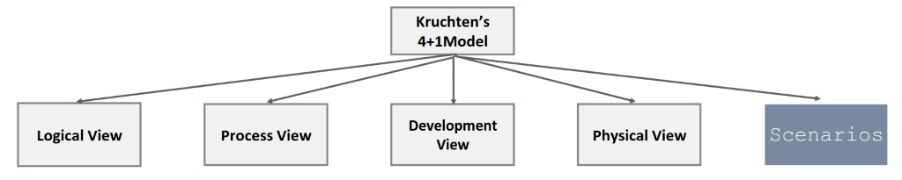

- **Pohled logický (Logical View)**:
   - Zobrazuje třídy, objekty, rozhraní a jejich vztahy
   - Zaměřuje se na funkcionalitu systému
- **Pohled procesní (Process View)**:
   - Popisuje procesy a konkurenci v systému
   - Zaměřuje se na výkonnost, škálovatelnost a stabilitu
- **Pohled vývojový (Development View)**:
   - Zobrazuje organizaci zdrojového kódu, knihoven a komponent
   - Zaměřuje se na správu kódu a modulární strukturu
- **Pohled fyzický (Physical View)**:
   - Popisuje mapování softwarových komponent na hardware
   - Zaměřuje se na nasazení a distribuci systému
- **Scénáře (Scenarios):**
   - Uplatňuje se pro ověření a validaci návrhu architektury
   - Pomáhá provést průřez všemi čtyřmi pohledy

### Jak 4+1 View Model zachycuje chování softwaru z různých perspektiv:

- **Logický pohled (Logical View)**:
  - Poskytuje abstraktní pohled na systém z hlediska funkčnosti
  - Umožňuje analyzovat a navrhovat statickou strukturu systému
  - Pomáhá identifikovat třídy, rozhraní a jejich vztahy
  - Slouží k pochopení domény a funkcí, které systém poskytuje

- **Procesní pohled (Process View)**:
  - Zkoumá chování systému z hlediska běhových procesů a vláken
  - Umožňuje identifikovat synchronizační a komunikační aspekty mezi jednotlivými procesy
  - Pomáhá zajišťovat škálovatelnost, výkonnost a stabilitu systému
  - Slouží k analýze a řešení problémů týkajících se konkurence a distribuce

- **Fyzický pohled (Physical View)**:
  - Popisuje, jak jsou softwarové komponenty nasazeny na hardwarové prostředky
  - Umožňuje řešit otázky týkající se komunikace a propojení mezi hardwarovými jednotkami
  - Pomáhá identifikovat potenciální omezení a problémy v hardwarové konfiguraci
  - Slouží k optimalizaci nasazení a distribuce systému

- **Vývojový pohled (Development View)**:
  - Zkoumá strukturu zdrojového kódu, knihoven a modulů
  - Umožňuje identifikovat závislosti a propojení mezi jednotlivými částmi kódu
  - Pomáhá zlepšovat čitelnost, udržitelnost a modularitu kódu
  - Slouží k usnadnění práce vývojářů a podpoře týmové spolupráce

- **Scénáře (Scenarios)**:
  - Představují konkrétní příklady použití systému (use cases)
  - Umožňují ověřit a validovat návrh architektury
  - Pomáhají identifikovat problémy a nedostatky v návrhu
  - Slouží k provádění průřezů mezi všemi čtyřmi pohledy a k integraci různých aspektů systému


### Co jsou scénáře:

Scénáře se často vztahují k atributům kvality ( = Atribut kvality je měřitelná nebo testovatelná vlastnost. systému, která se používá k určení toho, jak dobře je systém uspokojuje potřeby zúčastněných stran)

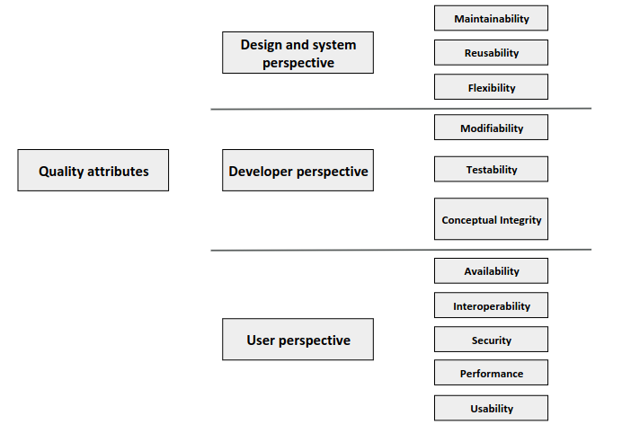

Obecné i konkrétní scénáře mají:

- **Zdroj podnětu**, což je cokoliv, co vytváří podnět. Může být interní nebo externí vůči systému.
- **Podnět** je podmínka, která způsobí, že systém zareaguje. Zdroj podmínky může vzniknout interně nebo externě, bude třeba rozlišovat typy podmínek.
- **Prostředí** je režim systému, když přijímá podnět. Jedná se o důležitý aspekt, zejména pokud systém zahrnuje distribuované výpočty nebo pokud může existovat i v jiných provozních režimech než jen v režimu spuštění a zastavení, jako je například zotavování se z poruchy.
- **Artefakt** je část systému, která je podnětem ovlivněna. V rozsáhlých systémech by měl podnět přímo ovlivnit celý systém.
- **Reakce** je to, jak se artefakt zachová v důsledku přijetí podnětu. Tato odezva může zahrnovat zpracování chyby, zotavení z poruchy, aktualizace systémových protokolů, odeslání bezpečnostních výstrah nebo změna systému. aktuálního prostředí.
- **Míra odezvy** je metrika používaná ke kvantifikaci odezvy, aby bylo možné měřit atribut kvality. Tato metrika by měla být kvantitativní a objektivní, například pravděpodobnost selhání, doba odezvy, doba opravy, a průměrné zatížení systému.

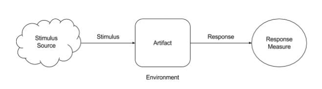

### Co je UML:

UML, Unified Modeling Language je v softwarovém inženýrství grafický jazyk pro vizualizaci, specifikaci, navrhování a dokumentaci programových systémů.

Máme 14 různých UML diagramů rozdělených do dvou skupin.

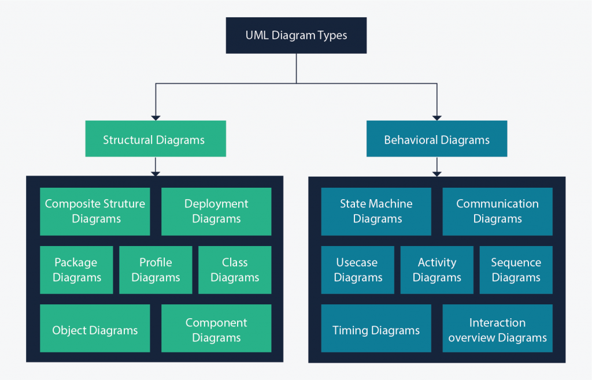

### Integrace UML s 4+1 View Model:

- UML diagramy poskytují vizuální reprezentaci pro každý pohled v 4+1 View Modelu
- Umožňují efektivní komunikaci mezi architekty, vývojáři, testery a dalšími členy týmu
- Podporují analýzu, návrh, implementaci a údržbu systému
- Usnadňují kontrolu a řízení kvality architektury

### UML diagramy pro 4+1 View Model:

- **Logický pohled (Logical View):**
    - Třídní diagram (Class Diagram)
    - Objektový diagram (Object Diagram)
    - Kompoziční struktura (Composite Structure Diagram)
    - Balíčkový diagram (Package Diagram)

- **Procesní pohled (Process View):**
    - Diagram činností (Activity Diagram)
    - Sekvenční diagram (Sequence Diagram)
    - Diagram spolupráce (Collaboration Diagram)
    - Stavový diagram (State Diagram)

- **Fyzický pohled (Physical View):**
    - Diagram nasazení (Deployment Diagram)
    - Diagram komponent (Component Diagram)
    - Komunikační diagram (Communication Diagram)

- **Vývojový pohled (Development View):**
    - Balíčkový diagram (Package Diagram)
    - Diagram komponent (Component Diagram)

## What is a software architecture? Describe the importance of software architecture when developing a system. What are the software architecture design guidelines? What are the architectural styles? Give an example of an architectural style and describe it in detail.

### Co je softwarová architektura?

Softwarová architektura je struktura komponent programu/systému, jejich vzájemné vazby, principy a předpisy určující jejich návrh a vývoj v průběhu času.

### Důležitost softwarové architektury při vývoji systému:

1. **Zajištění kvality**:
   - Architektura zajišťuje, že systém splňuje **funkční** a **nefunkční** požadavky.
2. **Usnadnění komunikace**:
   - Architektura slouží jako **společný jazyk** pro vývojáře, zákazníky a další zúčastněné strany.
3. **Podpora znovupoužitelnosti**:
   - Správně navržená architektura umožňuje **znovupoužití** kódu a komponent.
4. **Zjednodušení rozhodování**:
   - Architektura poskytuje **rámcové rozhodnutí** pro vývojáře, které usnadňuje vývoj a údržbu.
5. **Řízení rizik**:
   - Architektura pomáhá identifikovat a řešit **rizika** spojená s vývojem systému.
6. **Zlepšení výkonnosti**:
   - Architektura optimalizuje **výkonnost**, **škálovatelnost** a **stabilitu** systému.

### Zásady pro návrh softwarové architektury:

1. **Rozděl a panuj**:
   - Systém rozdělit na menší, snadno řiditelné komponenty.
2. **Abstrakce**:
   - Použít abstrakce pro zjednodušení složitých problémů.
3. **Modularita**:
   - Navrhnout nezávislé a snadno zaměnitelné moduly.
4. **Závislosti**:
   - Minimalizovat závislosti mezi komponentami.
5. **Škálovatelnost**:
   - Umožnit snadné rozšíření systému.
6. **Znovupoužitelnost**:
   - Navrhovat komponenty tak, aby byly znovupoužitelné.
7. **Flexibilita**:
   - Umožnit snadnou údržbu a přizpůsobení změnám požadavků.

### Architektonické styly:

Architektonické styly jsou **vzory** nebo **paradigmata** pro návrh softwarové architektury.

- **Monolitické**

    - **Vrstvená (layered)** – typická pro webové aplikace. Aplikace je rozdělena na vrstvy, které spolu komunikují (např. prezentační, servisní, datová). Vrstvy zapouzdřují určité chování a zajišťují vysokou kohezi.

    - **Mikrojádro (microkernel)** – naprogramuje se tzv. jádro aplikace, do kterého je následně možné přidávat pluginy, které rozšiřují funkcionalitu. Např. dnešní IDEčka jako IDEA.

    - **Roury a filtry (pipes and filters)** – systém je rozdělen na řetězec komponent, z nichž každá zprocesuje data pošle je do další komponenty. Typické jsou UNIXové roury.

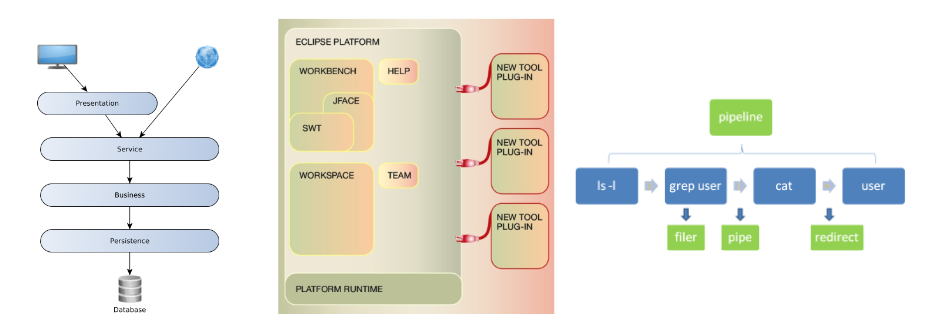

- **Distribuované**
  
    - **Service-based architecture** - Distribuované služby s hrubým členěním si navzájem poskytují funkce; Sdílené uživatelské rozhraní; Sdílená databáze (logické rozdělení); Flexibilní, řízené doménou
    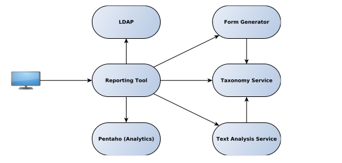

    - **Orchestrated service-oriented architecture** - Centrální orchestrační engine se stará o koordinaci procesů; Do orchestračního enginu lze přidat vlastní kód; Sběrnice Enterprise Service Bus - poskytovaná společnostmi Oracle, IBM atd.
    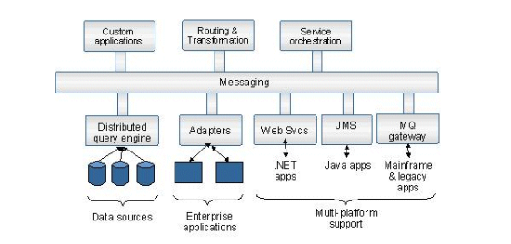

    - **Event-driven architecture** - Asynchronní komponenty zpracovávající a vysílající události; Asynchronní zprávy mezi klienty; Topologie: Broker - fronta zpráv brokera / Mediátor - centrální mediátor distribuující události; Problematické zpracování chyb, nedeterministický stav procesu
  
    - **Microservices**

### Uveďte příklad architektonického stylu a podrobně ho popište.

Typické pro webové aplikace, která se skládá po vrstvách. Například:

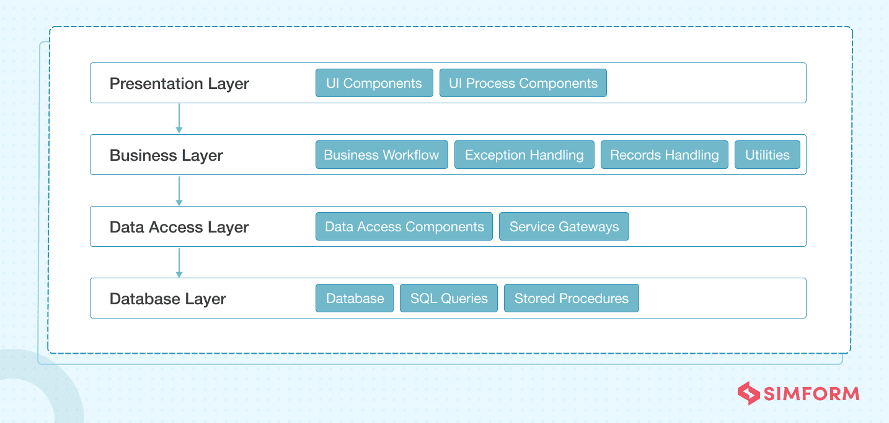

Vrstvený architektonický styl (layered architecture) je běžně používaný přístup při návrhu webových aplikací, který rozděluje aplikaci do oddělených vrstev s jasně definovanými rolemi a odpovědnostmi. Tento přístup zvyšuje modularitu, usnadňuje údržbu a testování aplikace. Typicky se vrstvená architektura skládá z těchto vrstev:

#### 1. Prezentační vrstva (Presentation Layer)
- **Účel:** Interakce s uživatelem
- **Komponenty:** HTML, CSS, JavaScript, front-end frameworky (např. React, Angular, Vue.js)
- **Funkce:** Zobrazuje data uživatelům a zpracovává uživatelské vstupy. Posílá požadavky na aplikační vrstvu a zobrazuje výsledky.

#### 2. Aplikační vrstva (Application Layer)
- **Účel:** Logika aplikace
- **Komponenty:** Back-end frameworky (např. Spring, ASP.NET, Django, Express.js)
- **Funkce:** Zpracovává požadavky z prezentační vrstvy, aplikuje podniková pravidla, koordinuje tok dat mezi prezentační a datovou vrstvou.

#### 3. Servisní vrstva (Service Layer)
- **Účel:** Poskytování služeb
- **Komponenty:** REST API, SOAP, GraphQL
- **Funkce:** Nabízí rozhraní pro aplikační logiku, umožňuje komunikaci mezi aplikační vrstvou a dalšími službami nebo systémy. V některých případech je součástí aplikační vrstvy.

#### 4. Datová vrstva (Data Layer)
- **Účel:** Přístup a manipulace s daty
- **Komponenty:** Databáze (SQL - MySQL, PostgreSQL; NoSQL - MongoDB, Cassandra), ORM (Object-Relational Mapping) nástroje (např. Hibernate, Entity Framework)
- **Funkce:** Spravuje přístup k databázím, zajišťuje uložení, načítání a manipulaci s daty. 

#### 5. Integrace a middleware (Integration and Middleware)
- **Účel:** Zprostředkování komunikace mezi různými částmi systému
- **Komponenty:** Message brokers (např. RabbitMQ, Kafka), middleware
- **Funkce:** Usnadňuje integraci a komunikaci mezi aplikační vrstvou a externími systémy, služby jako autentizace, logování, cache.

#### Přehled toku dat
1. **Prezentační vrstva** získá vstup od uživatele a posílá požadavek na aplikační vrstvu.
2. **Aplikační vrstva** zpracuje požadavek, případně využije **servisní vrstvu** k přístupu k externím službám.
3. **Aplikační vrstva** komunikuje s **datovou vrstvou** pro načtení nebo uložení potřebných dat.
4. **Datová vrstva** vrátí data aplikační vrstvě, která aplikuje podniková pravidla a připraví data pro zobrazení.
5. **Prezentační vrstva** obdrží data z aplikační vrstvy a zobrazí je uživateli.

#### Výhody vrstvené architektury
- **Modularita:** Každá vrstva má jasně definovanou roli, což usnadňuje vývoj, údržbu a testování.
- **Flexibilita:** Změny v jedné vrstvě obvykle nevyžadují změny v ostatních vrstvách.
- **Opětovná použitelnost:** Komponenty a služby v jednotlivých vrstvách mohou být znovu použity v různých částech aplikace.

#### Nevýhody vrstvené architektury
- **Výkon:** Více vrstev může znamenat více overheadu při komunikaci mezi vrstvami.
- **Komplexita:** Přidání více vrstev může zvýšit komplexitu návrhu a implementace.

Tento architektonický styl je vhodný pro mnoho webových aplikací, zejména ty, které vyžadují jasné oddělení logiky a prezentace, snadnou údržbu a rozšiřitelnost.

## What is a design pattern? What problem are design patterns solving? What types of design patterns exist? Why is it important to know the design patterns? Are there design antipatterns?

### Co je návrhový vzor (design pattern)?

- Návrhový vzor je **opakovatelné řešení** pro často se vyskytující problémy v oblasti softwarového návrhu.
- Není to hotový návrh, ale **šablona** pro řešení problému, kterou lze přizpůsobit konkrétním situacím.

### Jaký problém řeší návrhové vzory?

- Návrhové vzory řeší problémy, které se vyskytují opakovaně při návrhu softwarových systémů.
- Pomáhají **zlepšit kvalitu** kódu, **usnadnit komunikaci** mezi vývojáři a **urychlit vývoj**.

### Typy návrhových vzorů:

1. **Vzory pro tvorbu objektů (Creational Patterns)**:
   - Řeší problémy spojené s procesem vytváření objektů.
   - Příklady: Singleton, Factory Method, Abstract Factory, Builder, Prototype.
   - <u>Factory Method:</u> Vzor Tovární metoda navrhuje nahradit přímé volání konstrukce objektu (pomocí operátoru new) voláním speciální tovární metody. Nemějte obavy: objekty se stále vytvářejí pomocí operátoru new, ale ten se volá zevnitř tovární metody. Objekty vrácené tovární metodou se často označují jako produkty.
   - <u>Singleton:</u> Využijeme ho, když je potřeba, aby v celém programu existovala pouze jedna instance určité třídy. Návrhový vzor také poskytne globální přístupový bod k instanci. 
        ```Java
        public class Singleton {

            private static final Singleton instance = new Singleton();

            private Singleton() {
            }

            public static Singleton getInstance() {
                return instance;
            }

            // Použití je stejné
            public static void main(String[] args) {
                Singleton objekt = Singleton.getInstance();
            }
        }
        ```
2. **Strukturální vzory (Structural Patterns)**:
   - Řeší problémy týkající se kompozice tříd a objektů.
   - Příklady: Adapter, Bridge, Composite, Decorator, Facade, Flyweight, Proxy.
   - <u>Adapter:</u> Adaptér je konstrukční vzor, který umožňuje spolupráci objektů s nekompatibilními rozhraními. Jedná se o speciální objekt, který převádí rozhraní jednoho objektu tak, aby mu jiný objekt rozuměl.
    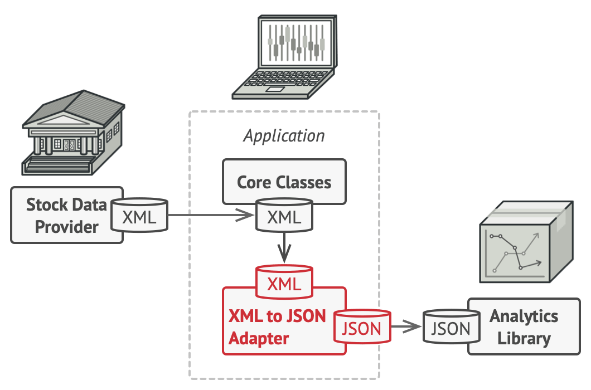
    - <u>Facade:</u> Fasáda je strukturální návrhový vzor, který poskytuje zjednodušené rozhraní ke knihovně, frameworku nebo jiné složité sadě tříd.
    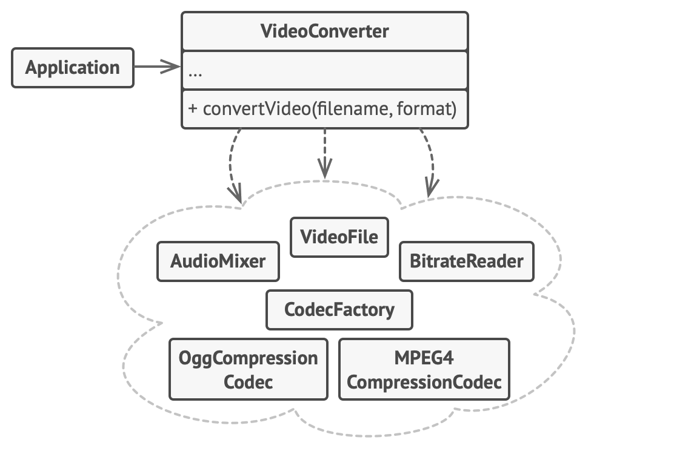
    - <u>Proxy:</u> Proxy je konstrukční vzor, který umožňuje poskytnout náhradu nebo zástupný objekt za jiný objekt. Zástupce řídí přístup k původnímu objektu a umožňuje provést něco předtím, než se požadavek dostane k původnímu objektu, nebo poté, co se k němu dostane.
    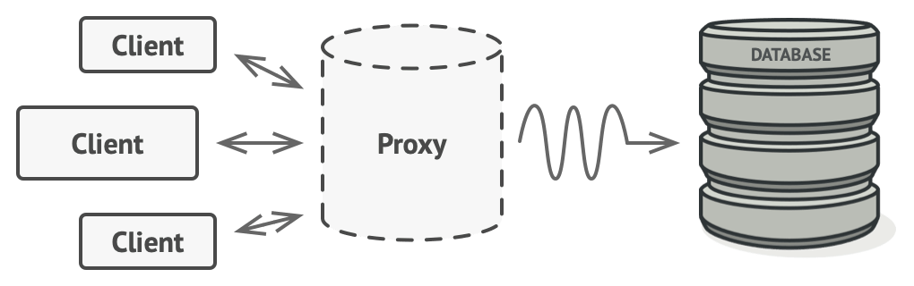
3. **Vzory chování (Behavioral Patterns)**:
   - Řeší problémy interakce mezi objekty a způsoby, jakými spolupracují.
   - Příklady: Chain of Responsibility, Command, Interpreter, Iterator, Mediator, Memento, Observer, State, Strategy, Template Method, Visitor.
   - <u>Observer:</u> Observer je návrhový vzor chování, který umožňuje definovat mechanismus odběru pro upozornění více objektů na všechny události, které se stanou s objektem, který pozorují.
   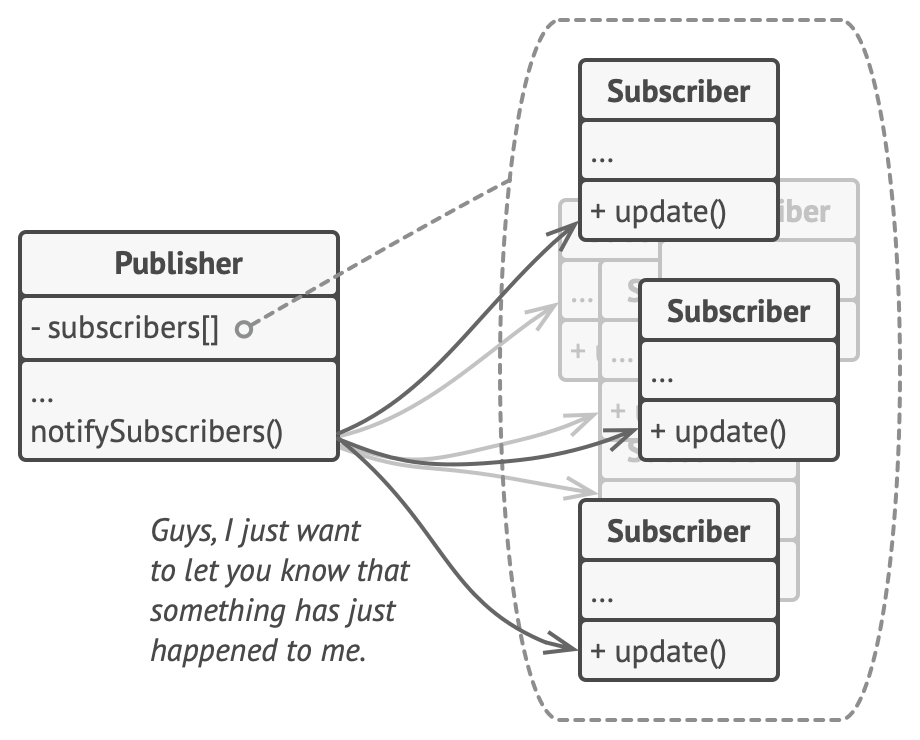
   - <u>Iterator:</u> Iterátor je návrhový vzor chování, který umožňuje procházet prvky kolekce, aniž by byla odhalena její základní reprezentace (seznam, zásobník, strom atd.). Hlavní myšlenkou vzoru Iterátor je extrahovat chování procházení kolekce do samostatného objektu zvaného iterátor.
    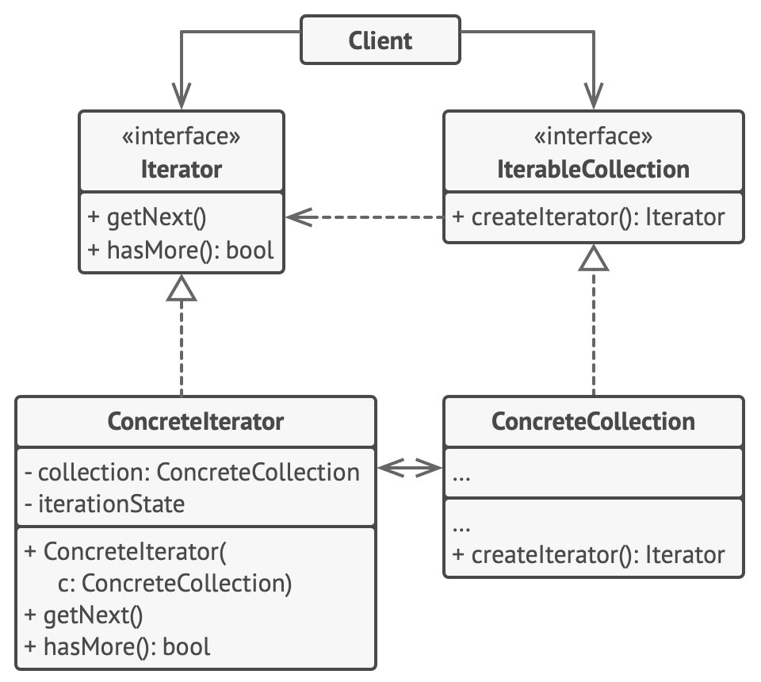

### Důležitost znalosti návrhových vzorů:

1. **Zlepšení kvality kódu**:
   - Návrhové vzory poskytují osvědčené řešení, která zvyšují kvalitu kódu.
2. **Zvýšení efektivity vývoje**:
   - Použitím návrhových vzorů lze urychlit vývoj a snížit chybovost.
3. **Usnadnění komunikace mezi vývojáři**:
   - Návrhové vzory slouží jako společný jazyk, který usnadňuje komunikaci a porozumění mezi vývojáři.
4. **Zjednodušení údržby**:
   - Návrhové vzory usnadňují údržbu a rozšiřování kódu díky jejich známé struktuře a principům.
5. **Podpora znovupoužitelnosti**:
   - Návrhové vzory podporují znovupoužitelnost kódu tím, že umožňují snadnější integraci a adaptaci kódu.

### Existují návrhové antivzory (design antipatterns)?

- Ano, návrhové antivzory existují.
- Jsou to **špatné řešení** nebo **protipříklady** dobrých návrhových vzorů.
- Návrhové antivzory mohou vést ke **špatně navrženému**, **těžko udržitelnému** a **neefektivnímu** kódu.
- Je důležité rozpoznat a vyhýbat se návrhovým antivzorům, aby byla zajištěna dobrá kvalita kódu a efektivní vývoj.
