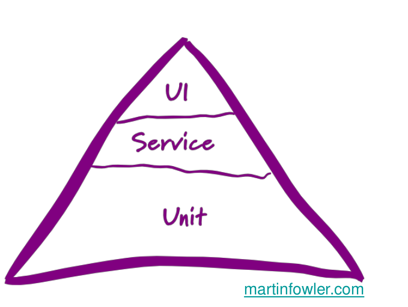

# ZKS (BE4M36ZKS)

## Questions

- Describe and compare the V and W models of the software testing process. Explain static testing and its role in the W model. Describe individual methods of static testing.

- Explain the principle of Model Based Testing (MBT) and compare its advantages and disadvantages with manual testing approach. Give some examples of models that can be employed in MBT. How does MBT relate to test automation?

- Outline the main test automation principle and economics. What are possible levels at which tests can be automated? Give some examples of main approaches and technologies that can be used in software test automation.

- Explain the equivalence class and boundary values concepts and principle of the Combinatorial Interaction Testing. What is a combinatorial explosion effect, how to effectively reduce the input data combinations? Principle of pairwise (2-way) and N-way testing.

- Principle of path-based testing. Formal definition of system model and test coverage criteria (node/edge coverage, edge-pair coverage, prime-path coverage). How prioritization of process/workflow activities is modelled and handled in the generation of the test cases?

## Termínus technikus

- **Black box testing:** Nevíme, co testujeme, nevidíme dovnitř, testy stavíme na základě pravděpodobných případů používání
- **White box testing:** Máme k dispozici kód, děláme informované testy nebo analýzu kódu
- **Verifikace:** Testujeme, jestli to odpovídá specifikaci
- **Validace:** Testujeme, jestli to je to, co klient chce
- **Regrese:** Do systému zanášíme další chyby při tom, jak se ho snažíme opravit.
- **Test coverage:** Pokrytí testů, tedy jaká část SW je otestovaná (řádky kódu, kombinace vstupů). Vyjadřuje se v procentech.
- **Smoke test:** Základní test funkcionality / předběžné testování
- **Test condition:** Něco, co testujeme, třeba funkce nebo jiná část systému. 

## Describe and compare the V and W models of the software testing process. Explain static testing and its role in the W model. Describe individual methods of static testing.

### Proč chceme dobrý způsob návrhu

Boehmův zákon : cena opravy chyby roste!

### Waterfall model

### V model

- Lineární model
- Testování je prováděno na konci vývojového procesu
- Fáze:
  1. Analýza požadavků
  2. Návrh systému
  3. Návrh architektury
  4. Návrh komponent
  5. Implementace
  6. Integrace
  7. Testování
  8. Nasazení
- Nevýhody:
  - Méně flexibilní než W-model
  - Změny v požadavcích mohou způsobit zpoždění a náklady

### W model

- Iterativní model
- Testování je prováděno během celého vývojového procesu
- Fáze:
  1. Analýza požadavků
  2. Návrh systému
  3. Návrh architektury
  4. Návrh komponent
  5. Implementace
  6. Integrace
  7. Testování
  8. Nasazení
- Výhody:
  - Flexibilnější než V-model
  - Snadnější detekce a řešení problémů v průběhu vývoje
  - Změny v požadavcích méně pravděpodobně způsobí zpoždění a náklady

### Srovnání V-modelu a W-modelu:

- V-model je lineární a méně flexibilní
- W-model je iterativní a flexibilnější
- V-model provádí testování až na konci vývoje
- W-model provádí testování během celého vývoje

### Statické testování a jeho role ve W-modelu:

#### Statické testování:
- Testování softwaru bez spuštění kódu
- Zaměřuje se na kontrolu kódu, dokumentace a dalších artefaktů
- Techniky statického testování:
  - Průzkum kódu (Code review)
  - Statická analýza kódu (Static code analysis)
  - Kontrola dokumentace (Documentation review)
  - Průzkum návrhu (Design review)
  - Kontrola požadavků (Requirements review)

#### Role ve W-modelu:
- Statické testování je důležitou součástí W-modelu
- Provádí se během celého vývojového procesu, nejen v testovací fázi
- Pomáhá detekovat a řešit problémy v kódu a dokumentaci dříve
- Redukuje riziko chyb a náklady spojené s opravami
- Přispívá k vyšší kvalitě softwaru

### Individuální metody statického testování:

1. Průzkum kódu (Code review):
   - Manuální kontrola zdrojového kódu
   - Hledání chyb, nedostatků, či nesouladu se standardy
   - Mohou být prováděny kolegy, týmem nebo i autorem kódu (sebereview)

2. Statická analýza kódu (Static code analysis):
   - Automatická kontrola zdrojového kódu pomocí nástrojů a algoritmů
   - Identifikace potenciálních chyb, problémů a nesouladů se standardy
   - Příklady nástrojů: FindBugs, PMD, SonarQube, JSHint

3. Kontrola dokumentace (Documentation review):
   - Manuální kontrola dokumentace projektu
   - Ověření správnosti, úplnosti a srozumitelnosti informací
   - Zahrnuje kontrolu technické dokumentace, návody, specifikace apod.

4. Průzkum návrhu (Design review):
   - Manuální kontrola návrhu systému nebo komponenty
   - Ověření, zda návrh splňuje požadavky a je vhodný pro implementaci
   - Posouzení technických a architektonických rozhodnutí

5. Kontrola požadavků (Requirements review):
   - Manuální kontrola specifikace požadavků na systém
   - Ověření správnosti, úplnosti a srozumitelnosti požadavků
   - Hledání možných konfliktů, nejasností nebo nekonzistencí

## Explain the principle of Model Based Testing (MBT) and compare its advantages and disadvantages with manual testing approach. Give some examples of models that can be employed in MBT. How does MBT relate to test automation?

### Manuální testování:
- Testování prováděné testerem
- Tester kontroluje systém nebo aplikaci podle testovacích scénářů
- Zahrnuje funkční, UI a uživatelský zážitek testování

### Model Based Testing (MBT):
- Testování založené na modelech
- Vytvoření abstraktního modelu systému nebo aplikace
- Generování testovacích případů z modelu pomocí algoritmů a nástrojů
- Automatická tvorba a provádění testů

### Výhody MBT oproti manuálnímu testování:
- Rychlejší generování testovacích případů
- Vyšší pokrytí testů díky systematickému přístupu
- Minimalizace lidských chyb při tvorbě a provádění testů
- Lehčí aktualizace testů při změnách v systému nebo požadavcích
- Úspora času a nákladů na vývoj

### Nevýhody MBT oproti manuálnímu testování:
- Vyšší počáteční náklady na vytvoření a udržbu modelu
- Nutnost specializovaných znalostí a nástrojů pro MBT
- Možné omezení v modelování složitých nebo nestandardních situací
- Menší vhodnost pro testování UI nebo uživatelského zážitku

### Příklady modelů použitelných v Model Based Testing (MBT):

1. Konečný automat (Finite State Machine, FSM):
   - Model založený na stavech a přechodech mezi nimi
   - Popisuje chování systému nebo komponenty
   - Vhodný pro testování systémů s omezeným počtem stavů a přechodů

2. Petriho síť (Petri Net):
   - Matematický model pro popis distribuovaných systémů
   - Zahrnuje místa, přechody a tokeny pro popis chování
   - Použitelný pro testování paralelních nebo konkurenčních systémů

3. Markovův řetězec (Markov Chain):
   - Model náhodných procesů s konečným počtem stavů
   - Přechody mezi stavy závisejí pouze na aktuálním stavu
   - Užitečný pro testování systémů s pravděpodobnostními přechody

4. Scénářové modely (Scenario Models):
   - Modely popisující konkrétní případy užití nebo interakce s aplikací
   - Vhodné pro testování funkcionality systému z pohledu uživatele

5. Datové modely (Data Models):
   - Modely zaměřené na strukturu a vztahy mezi daty v systému
   - Použitelné pro testování datových operací, jako je ukládání, načítání a zpracování dat

### Vztah MBT k automatickému testování:

- MBT je způsob, jak generovat testovací scénáře a případy z modelů systému
- Automatické testování je proces spouštění těchto testovacích případů bez lidské interakce
- MBT a automatické testování se často používají společně:
  - MBT generuje testovací případy
  - Automatické testování provádí tyto testovací případy
  - Tím se zvyšuje efektivita, rychlost a přesnost testování

## Outline the main test automation principle and economics. What are possible levels at which tests can be automated? Give some examples of main approaches and technologies that can be used in software test automation.

### Principy automatizace testování:
- Snížení lidského úsilí při provádění testů
- Zvýšení rychlosti a přesnosti testování
- Systematický a konzistentní přístup k testování
- Snížení rizika lidských chyb
- Možnost častějšího a průběžného testování
- eliminace duplikátů

### Ekonomika automatizace testování:
- Vyšší počáteční náklady na nástroje a přípravu testů
- Nižší náklady na provádění testů dlouhodobě
- Snížení nákladů na opravy chyb díky dřívějšímu odhalení
- Rychlejší nasazení a aktualizace softwaru

Ve chvíli, kdy se SUT nemění, se úsilí vynaložené v rámci přípravy automatizovaných testů může rychle vrátit. 

Reálně se ale SUT mění, a tak se může stát, že se automatizované testování prodraží, neboť musíme v případě změn do testů zasahovat, což zvyšuje nákladnost. Graf níže poukazuje na fakt, že se nám automatické testování může vyplatit až po hodně dlouhé době.

### Úrovně automatizace testů:

1. **Jednotkové testy (Unit tests)**:
   - Automatické testování jednotlivých funkcí nebo tříd
   - Zajišťují, že jednotlivé komponenty fungují správně

2. **Integrační testy (Integration tests)**:
   - Automatické testování interakce mezi komponentami nebo systémy
   - Ověřují, že celý systém funguje správně jako celek

3. **Systémové testy (System tests)**:
   - Automatické testování celého systému nebo aplikace
   - Kontrolují, zda systém splňuje požadavky a očekávání uživatelů

4. **Uživatelské akceptační testy (User Acceptance tests, UAT)**:
   - Částečně automatizované testování z pohledu uživatele a jeho zkušeností
   - Ověřují, že aplikace je připravena k nasazení a použití

5. **Regresní testy (Regression tests)**:
   - Automatické testování zaměřené na odhalení chyb po změnách v kódu
   - Kontrolují, že nové změny nezpůsobily problémy v již otestovaných částech

test automation pyramid

W model 

### Příklady hlavních přístupů a technologií používaných v automatizaci testování softwaru:

1. Nástroje pro jednotkové testování (Unit testing tools):
   - JUnit (pro Java)
   - NUnit (pro .NET)
   - Mocha (pro JavaScript)
   - Pytest (pro Python)
   - Pomáhají vytvářet a provádět jednotkové testy pro jednotlivé komponenty

2. Nástroje pro integrační a systémové testování (Integration and system testing tools):
   - Selenium (pro webové aplikace)
   - Appium (pro mobilní aplikace)
   - JMeter (pro testování výkonnosti)
   - SoapUI (pro testování webových služeb)
   - Umožňují automatizaci testů na úrovni celého systému nebo aplikace

3. Rámce pro Behavior-Driven Development (BDD):
   - Cucumber (pro Ruby, Java, .NET)
   - SpecFlow (pro .NET)
   - Behave (pro Python)
   - Pomáhají vytvářet testy založené na chování systému a propojení s požadavky

4. Nástroje pro kontinuální integraci (Continuous Integration, CI) a kontinuální nasazení (Continuous Deployment, CD):
   - Jenkins
   - GitLab CI/CD
   - Bamboo
   - CircleCI
   - Travis CI
   - Umožňují automatizovat provádění testů a nasazení aplikace v průběhu vývoje

5. Testovací nástroje pro vizuální porovnávání (Visual testing tools):
   - Applitools
   - Percy
   - Galen Framework
   - Porovnávají vizuální vzhled aplikace napříč různými prohlížeči, platformami a obrazovkami
   - Cypress

6. Nástroje pro nahrávání a přehrávání testů (Record and playback tools):
   - Selenium IDE
   - Katalon Studio
   - Umožňují nahrát testovací scénáře při manuálním provádění testu a poté je automaticky přehrát

## Explain the equivalence class and boundary values concepts and principle of the Combinatorial Interaction Testing. What is a combinatorial explosion effect, how to effectively reduce the input data combinations? Principle of pairwise (2-way) and N-way testing.

### Ekvivalentní třída (Equivalence Class):
- Koncept založený na rozdělení vstupních hodnot do skupin, které vykazují podobné chování
- Každá skupina se nazývá ekvivalentní třída
- Testování se provádí na základě reprezentativního vzorku hodnot z každé třídy
- Účinně snižuje počet testovacích případů, aniž by se snížila účinnost testování

rozdělím je z více pohledů

### Hraniční hodnoty (Boundary Values):
- Koncept zaměřený na testování hodnot na hranicích ekvivalentních tříd
- Hraniční hodnoty často zahrnují:
  - Minimální a maximální hodnoty
  - Hodnoty těsně nad a pod minimálními a maximálními hodnotami (spojité musím diskretizovat)
- Testování hraničních hodnot je založeno na pozorování, že chyby se často vyskytují u hranic ekvivalentních tříd

### Kombinatorické interakční testování (Combinatorial Interaction Testing):
- Princip spočívá v testování všech možných kombinací dvou nebo více proměnných
- Zaměřuje se na odhalování chyb způsobených nečekanými interakcemi mezi proměnnými
- Kombinatorické testování může být prováděno pomocí různých technik, jako je:
  - Pairwise testing (testování všech možných dvojic proměnných)
  - Orthogonal arrays (testování s omezeným počtem kombinací, které zahrnují všechny možné interakce)
- Účinně snižuje počet testovacích případů, aniž by se snížila účinnost testování

### Kombinatorický výbuch (Combinatorial Explosion):
- Efekt, kdy počet kombinací vstupních dat rychle roste s přibývajícím počtem proměnných nebo hodnot
- Výsledkem je velký počet testovacích případů, což zvyšuje nároky na čas a zdroje při testování

### Jak efektivně snížit kombinace vstupních dat:

1. **Pairwise testing (dvojice testů)**:
   - Testování všech možných dvojic proměnných místo všech kombinací
   - Značně snižuje počet testovacích případů, aniž by se značně snížila účinnost testování

2. **Orthogonal Arrays (ortogonální pole)**:
   - Testování s omezeným počtem kombinací, které zahrnují všechny možné interakce mezi proměnnými
   - Pomáhá snížit počet testovacích případů, zatímco zachovává dobré pokrytí interakcí

3. **Testování založené na prioritách**:
   - Prioritizace testovacích případů na základě rizik a pravděpodobnosti chyb
   - Provedení testů s vyšší prioritou a omezení testů s nižší prioritou

4. **Ekvivalentní třídy (Equivalence Classes) a hraniční hodnoty (Boundary Values)**:
   - Rozdělení vstupních hodnot do ekvivalentních tříd a testování na základě reprezentativního vzorku
   - Testování hraničních hodnot, které se zaměřuje na hodnoty na hranicích tříd

5. **Model-Based Testing (MBT)**:
   - Vytvoření matematického nebo formálního modelu systému a generování testovacích případů z tohoto modelu
   - Pomáhá snížit počet testovacích případů a současně zvyšuje účinnost testování

6. **Podmínky**:
    - testovat např IE prohlížeč s macOS nemá cenu

### Pairwise (2-way) testing:

- Pairwise testing je technika kombinatorického testování, která zkoumá interakce mezi dvojicemi proměnných
- Místo testování všech možných kombinací proměnných se zaměřuje na testování všech dvojic proměnných
- Vychází z předpokladu, že většina chyb je způsobena interakcemi mezi jednotlivými páry proměnných
- Pairwise testing značně snižuje počet testovacích případů, aniž by se značně snížila účinnost testování
- Nástroje, jako jsou AllPairs, PICT nebo Hexawise, mohou být použity pro generování pairwise testovacích případů

pro každou pozici 1-2, 1-3, 2-5, ... zkusíme všechny kombinace

Dvoucestné (pairwise) testování zahrnuje všechny možné páry parametrů, co se v systému vyskytují. V případě N-cestného jde o všechny možné N-tice. 

**Proč funguje** Statisticky se ukázalo, že pairwise odhalí drtivou většinu chyb

Složitý vymyslet z hlavy, bude na to potřeba nějaký software

### N-way testing:

- N-way testing je rozšířením pairwise testingu, které zkoumá interakce mezi N proměnnými
- Pro N > 2 se zvyšuje pokrytí interakcí mezi proměnnými, ale roste také počet testovacích případů
- N-way testing může být užitečné pro systémy s vyšší mírou komplexnosti nebo vyšším rizikem chyb způsobených interakcemi mezi více proměnnými
- Volba hodnoty N závisí na rovnováze mezi potřebou pokrytí interakcí a omezením počtu testovacích případů
- Nástroje, jako jsou AllPairs, PICT nebo Hexawise, mohou být také použity pro generování N-way testovacích případů s různými hodnotami

## Principle of path-based testing. Formal definition of system model and test coverage criteria (node/edge coverage, edge-pair coverage, prime-path coverage). How prioritization of process/workflow activities is modelled and handled in the generation of the test cases?

Testování založené na cestách je metoda testování softwaru, která navrhuje testovací případy na základě všech možných cest, které mohou být provedeny programem prostřednictvím jeho grafu řízení toku.

### Formální definice modelu systému a kritéria pokrytí testů:

1. Node (uzel) coverage:
   - Požadavek, aby každý uzel v grafu byl navštíven alespoň jednou během testování
   - Zaměřuje se na procházení všech možných stavů systému
   - Méně náročné než ostatní kritéria pokrytí, ale méně účinné v odhalování chyb

2. Edge (hrana) coverage:
   - Požadavek, aby každá hrana v grafu byla projita alespoň jednou během testování
   - Zaměřuje se na testování všech možných přechodů mezi uzly
   - Přináší lepší pokrytí než node coverage, ale vyšší nároky na testovací případy
   - TDL = 1 (Edge coverage) znamená, že pro každý vrchol testujeme všechny možné způsoby výstupů z něj:

    

3. Edge-pair coverage:
   - Požadavek, aby každá dvojice sousedních hran v grafu byla projita alespoň jednou během testování
   - Zaměřuje se na testování všech možných sekvencí dvou přechodů mezi uzly
   - Poskytuje ještě lepší pokrytí než edge coverage, ale s vyššími nároky na testovací případy
   - TDL = 2 (Edge-pair coverage) znamená, že pro každý vrchol testujeme kombinaci všech způsobů, jak se do něj dostat se všemi možnými akcemi jež můžeme vykonat na výstupu.
    
    

    TDL = 3 funguje obdobně jako TDL = 2, akorát na výstupu uvažujeme všechni možné dvojice akcí.

    

4. Prime-path coverage:
   - Požadavek, aby každá jedinečná, nezkrácená cesta v grafu byla projita alespoň jednou během testování
   - Zaměřuje se na testování všech možných sledů uzlů a hran bez opakování
   - Poskytuje nejlepší pokrytí v porovnání s ostatními kritérii, ale s nejvyššími nároky na testovací případy
    - Jednoduchá cesta je cesta grafem, která neobsahuje dvakrát stejný vrchol.
    - Prime path je jednoduchá cesta, která se navíc nikde nevyskytuje jakožto podcestou jiné jednoduché cesty.
    

Reálný příklad

### Prioritizace procesů/workflow aktivit při generování testovacích případů:

1. Analýza rizik:
   - Identifikace oblastí s nejvyšším rizikem chyb nebo dopadů na systém
   - Prioritizace testování těchto oblastí s vyšším rizikem
   - Pomáhá alokovat zdroje na nejvíce kritické části systému

2. Důležitost funkcí:
   - Určení důležitosti jednotlivých funkcí nebo workflow aktivit pro uživatele nebo systém
   - Testování nejdůležitějších funkcí má vyšší prioritu
   - Zajišťuje, že klíčové části systému jsou pečlivě testovány

3. Frekvence použití:
   - Identifikace často používaných funkcí nebo workflow aktivit
   - Prioritizace testování těchto často používaných částí
   - Alokace zdrojů na oblasti, které mají největší dopad na uživatele

4. Historie chyb:
   - Analýza předchozích chyb a identifikace oblastí, které jsou náchylnější k chybám
   - Prioritizace testování těchto částí systému
   - Zaměření na odhalení a opravu chyb v problémových oblastech

5. Závislosti mezi komponentami:
   - Identifikace komponent nebo workflow aktivit, které mají významné závislosti na ostatních částech systému
   - Prioritizace testování těchto závislých částí
   - Odhalení chyb v závislých komponentách, které by mohly ovlivnit celý systém

6. Testovací techniky a kritéria pokrytí:
   - Použití různých testovacích technik, jako jsou ekvivalentní třídy, hraniční hodnoty, kombinatorické testování nebo testování založené na cestách
   - Určení kritérií pokrytí pro testování, jako je node coverage, edge coverage, edge-pair coverage nebo prime-path coverage
   - Prioritizace testovacích případů na základě zvolených technik a kritérií pokrytí

### Další termíny

- **MCC - Multiple Condition Coverage**: testujeme všechny možné kombinace
- **MC/DC - Modified Condition/Decision Coverage**: testujeme všechny kombinace, které mají mít odlišný výsledek	
  
  Chceme, aby se každá proměnná objevila v každé své možné hodnotě a chceme, aby se výsledek objevil v každé své hodnotě
- **C/DC** - Condition/Decision Coverage
- **CC** - Condition Coverage
- **DC** - Decision Coverage
- **Exploratory testing** - je často popisován jako simultánní učení, návrh testu a provádění. Zaměřuje se na objevování a spoléhá na vedení jednotlivých testerů při odhalování defektů, které nelze snadno pokrýt v rámci jiných testů. Testeři volně testují appku, historie se nezaznamenává a není jisté co bylo otestováno.
- **CI/CD**
  

- **Testovací pyramida**
    
    

- **Tets doubles** - Test double je objekt, který může v testu zastoupit skutečný objekt, jako když se postaví kaskadérský dvojník pro herce ve filmu. Test double je objekt, který při testu používáme místo skutečného objektu.